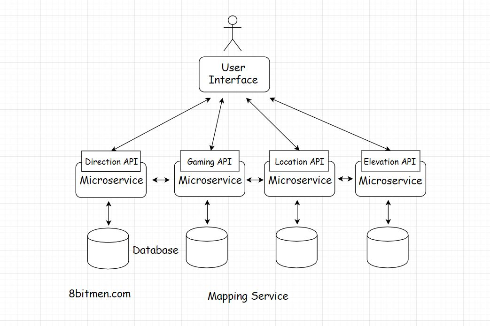
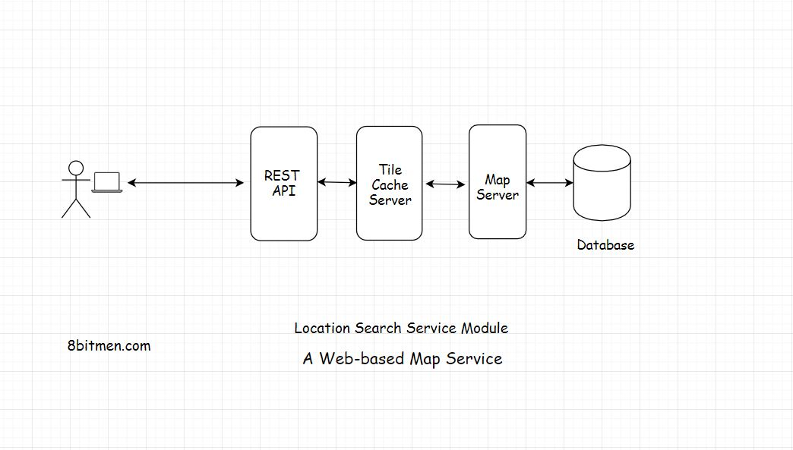

In this lesson, we will discuss a case study of a web-based mapping service like Google Maps.

We'll cover the following
<svg xmlns="http://www.w3.org/2000/svg" width="24" height="24" viewBox="0 0 24 24" fill="none" stroke="currentColor" stroke-width="2" stroke-linecap="round" stroke-linejoin="round"><polyline points="18 15 12 9 6 15"></polyline></svg>

<ul>
<li>
<ul>
<li><a href="#a-little-background-on-google-maps">A Little Background On Google Maps</a></li>
</ul>
</li>
<li>
<ul>
<li><a href="#read-heavy-application">Read-Heavy Application</a></li>
</ul>
</li>
<li>
<ul>
<li><a href="#data-type-spatial">Data Type: Spatial</a></li>
</ul>
</li>
<li>
<ul>
<li><a href="#database">Database</a></li>
</ul>
</li>
<li>
<ul>
<li><a href="#architecture">Architecture</a></li>
</ul>
</li>
<li>
<ul>
<li><a href="#backend-technology">Backend Technology</a></li>
</ul>
</li>
<li>
<ul>
<li><a href="#monolith-vs-microservice">Monolith Vs Microservice</a>
<ul>
<li><a href="#apis">APIs</a></li>
</ul>
</li>
</ul>
</li>
<li>
<ul>
<li><a href="#server-side-rendering-of-map-tiles">Server-Side Rendering Of Map Tiles</a></li>
</ul>
</li>
<li>
<ul>
<li><a href="#user-interface">User Interface</a></li>
</ul>
</li>
<li>
<ul>
<li><a href="#real-time-features">Real-time Features</a></li>
</ul>
</li>
</ul>

Before I begin talking about the architecture of the service, I would like to state that this is not a system design lesson, as it doesn’t contain any of the database design, traffic estimations or code of any sort.

I will just discuss the basic architectural aspects of the service and how do the concepts we’ve learned in the course apply here.

Let’s get on with it.

<h2 id="a-little-background-on-google-maps" data-id="2b42b8d77654ee174ad4efb3d41ded8a">A Little Background On Google Maps <a class="markdownIt-Anchor" href="#a-little-background-on-google-maps">#</a></h2>

<em><a href="https://cloud.google.com/maps-platform/" target="_blank">Google Maps</a></em> is a web-based mapping service by <em>Google</em>. If offers satellite imagery, route planning features, real-time traffic conditions, an API for writing map-based games like <em>Pokemon Go</em> &amp; several other features.

First up, these massive successful services are a result of years of evolution and iterative development. Online services are built feature by feature and take years to perfect. <em>Google Maps</em> started as a desktop-based software written in <em>C++</em> &amp; evolved over the years to become what it is today. A beautiful mapping service used by over a billion users.

<h2 id="read-heavy-application" data-id="68723848008b5e571a9412377b09c904">Read-Heavy Application <a class="markdownIt-Anchor" href="#read-heavy-application">#</a></h2>

Let’s get down to the technicalities of it. An application like this is <em>read-heavy</em> &amp; not <em>write-heavy</em>. As the end-users aren’t generating new content in the application over time. Users do perform some write operations though it is negligible in comparison to a write-heavy application like <em>Twitter</em> or <em>Instagram</em>.
This means the data can be largely cached and there will be significantly less load on the database.

<h2 id="data-type-spatial" data-id="1054faeb056650d79337fde61e87bde2">Data Type: Spatial <a class="markdownIt-Anchor" href="#data-type-spatial">#</a></h2>

Speaking of the data, a mapping application like this has <em>spatial data</em>. <em>Spatial data</em> is the data with objects representing geometric information like points, lines, polygons. The data also contains alphanumeric stuff like <em><a href="https://en.wikipedia.org/wiki/Geohash" target="_blank">Geohash</a></em>, latitudes, longitudes, <em>GIS Geographical Information System</em> data etc.

There are dedicated <em>spatial databases</em> available for persisting this kind of data. Also, popular databases like <em>MySQL</em>, <em><a href="https://docs.mongodb.com/manual/core/geospatial-indexes/" target="_blank">MongoDB</a></em>, <em><a href="https://github.com/couchbase/geocouch/" target="_blank">CouchDB</a></em>, <em>Neo4J</em>, <em><a href="https://github.com/EverythingMe/geodis" target="_blank">Redis</a></em>, <em><a href="https://cloud.google.com/bigquery/docs/gis-intro" target="_blank">Google Big Query GIS</a></em> also support persistence of <em>spatial data</em>. They have additional plugins built for it.

If you want to read more about Spatial databases. <a href="https://en.wikipedia.org/wiki/Spatial_database" target="_blank">This is a good read</a>.

<h2 id="database" data-id="77b118cce6c1c03a436ac621c802ae98">Database <a class="markdownIt-Anchor" href="#database">#</a></h2>

The coordinates of the places are persisted in the database and when the user runs a search for a specific location the co-ordinates are fetched from the database &amp; the numbers are converted into a map image.

We can expect the surge in traffic on the service during the peak office hours, during festivals or major events in the city. We need dynamic <em>horizontal scalability</em>, to manage the traffic spikes. The app needs to be <em>elastic</em> to scale up and down on the fly.

As I brought this up earlier, we have the option of picking from multiple databases as both <em>relational</em> and <em>non-relational</em> support persistence of <em>spatial data</em>. I will be more inclined to pick a <em>non-relational NoSQL</em> one as the map data doesn’t contain many relationships. It’s a direct fetch of the co-ordinates &amp; the processing of them based on the user request. Also, a <em>NoSQL</em> database is inherently <em>horizontally scalable</em>.

Though, we can scale well with a <em>relational database</em> too with <em>caching</em> as the application is read-heavy. But in <em>real-time</em> use cases with a lot of updates, it will be a bit of a challenge.

<em>Real-time</em> features like <em>LIVE</em> traffic patterns, information on congested routes, the suggestion of alternative routes as we drive in real-time etc. are pretty popular with the users of <em>Google Maps</em>.

<h2 id="architecture" data-id="79f6472b555855dfe2403a20cb660d11">Architecture <a class="markdownIt-Anchor" href="#architecture">#</a></h2>

Naturally, to set up a service like this we will pick a <em>client-server</em> architecture as we need control over the service. Else we could have thought about the <em>P2P</em> architecture.
But <em>P2P</em> won’t do us any good here.

<h2 id="backend-technology" data-id="df5c37480ffa42a427a710fc5595d964">Backend Technology <a class="markdownIt-Anchor" href="#backend-technology">#</a></h2>

Speaking of the server-side language we can pick <em>Java</em>, <em>Scala</em>, <em>Python</em>, <em>Go</em>. Any of the mature backend technology stack will do. My personal pick will be <em>Java</em>, since it is performant, heavily used for writing scalable distributed systems, as well as for the enterprise development.

<h2 id="monolith-vs-microservice" data-id="d37ab6d1e84e565c11bf26f692067c76">Monolith Vs Microservice <a class="markdownIt-Anchor" href="#monolith-vs-microservice">#</a></h2>

Speaking of <em>monolithic architecture</em> vs <em>microservice</em>, which one do you think we should pick for writing the app?

Let’s figure this out by going through the features of the service. The core feature is the map search. The service also enables us to plan our routes based on different modes of travel, by car, walking, cycling etc.

Once our trip starts, the map offers alternative route locations in real-time. The service adjusts the map based on the user’s real-time location &amp; the destination.

<h3 id="apis" data-id="96365b5fe0a052c0262048938a78a261">APIs <a class="markdownIt-Anchor" href="#apis">#</a></h3>

For the third-party developers, <em>Google</em> offers different <em>APIs</em> such as the <em>Direction API</em>, <em>Distance Matrix</em>, <em>Geocoding</em>, <em>Places</em>, <em>Roads</em>, <em>Elevation</em>, <em>Time zone</em>, <em>Custom search API</em>.

The <em>Distance matrix API</em> tells us how much time will it take to reach a destination depending on the mode of travel walking, flying, driving. <em>Real-time</em> alternative routes are displayed with the help of predictive modelling based on machine learning algorithms. The <em>Geocoding API</em> is about converting numbers into actual places &amp; vice versa.

<em>Google Maps</em> also has a <em>Gaming API</em> for building map-based games.

Though we may not have to implement everything in the first release. But this gives us a clue that a <em>monolithic architecture</em> is totally out of the picture.

We need <em>microservices</em> to implement so many different functionalities. Write a separate service for every feature. This is a cleaner approach, helps the service scale and stay highly available. If a few services like real-time traffic, elevation API etc. go down, the core search remains unaffected.

<h2 id="server-side-rendering-of-map-tiles" data-id="c3e161c6119a754f417d96de278f8c0d">Server-Side Rendering Of Map Tiles <a class="markdownIt-Anchor" href="#server-side-rendering-of-map-tiles">#</a></h2>

Speaking of the core location search service, when the user searches for a specific location. The service has to match the search text with the name of the location in the database and pull up the coordinates of the place.

Once the service has the co-ordinates how do we convert those into an image? Also, should we render the image on the client or the server?

<em>Server-side rendering</em> is a preferable option in this scenario as we can cache the rendered image for future requests, as the image is kind of a static content &amp; will be same for all the users.

Also, as opposed to generating a single image of the map for the full web page, the entire map is broken down into tiles that enable the system to generate only the part of the map user engages with.

Smaller tiles help with the zoom in &amp; out operations. You might have noticed this when using <em>Google Maps</em>, that instead of the entire web page being refreshed, the map is refreshed in sections or tiles. Rendering the entire map instead of tiles every time would be very resource-intensive.

We can create the map in advance by rendering it on the server &amp; caching the tiles. Also, we need a dedicated map server to render the tiles on the backend.

<h2 id="user-interface" data-id="35b3e99244601321f151cf6e6b8d0473">User Interface <a class="markdownIt-Anchor" href="#user-interface">#</a></h2>

Speaking of the <em>UI</em>, we can write that using <em>JavaScript</em>, <em>Html5</em>. Simple <em>JavaScript</em>, <em>Jquery</em> serves me well for simple requirements. But if you want to leverage a framework, you can look into <em>React</em>, <em>Angular</em> etc.

The <em>UI</em> having <em>JavaScript</em> events enable the user to interact with the map, pin locations, search for places, draw markers and other vectors on the map etc.

<em><a href="https://openlayers.org/" target="_blank">OpenLayers</a></em> is a popular open-source <em>UI</em> library for making maps work with web browsers. You can leverage it if you do not want to write everything from the ground up.

Okay!! So, the user runs a search for a location, on the backend, the request is routed to the tile cache. The cache which has all the pre-generated tiles. It sits between the UI and the map server. If the requested tile is present in the cache it is sent to the UI. If not, the map server hits the database fetches the co-ordinates and related data &amp; generates the tile.

<h2 id="real-time-features" data-id="1c68bc2dd67a19458980d65e625f3a6f">Real-time Features <a class="markdownIt-Anchor" href="#real-time-features">#</a></h2>

Coming to the <em>real-time</em> features. To implement it we have to establish a <em>persistent connection</em> with the server. We’ve been through the <em>persistent connections</em> in detail in the course.

Though <em>real-time</em> features are cool, they are very resource-intensive. There is a limit to the number of <em>concurrent connections</em>, servers can handle. So, I’ll advise implementing real-time features only when it’s really required.

This is a good read on the topic, <a href="https://www.8bitmen.com/how-hotstar-scaled-with-10-3-million-concurrent-users-an-architectural-insight/" target="_blank">how Hotstar a video streaming service scaled with over 10 million concurrent users</a>

Well, this is pretty much it on a web-based mapping service. We’ve covered the backend, database, caching and the UI &amp; a fundamental understanding of how a service like <em>Google Maps</em> works.

I’ll see you in the next lesson, where we will discuss a baseball game online ticket booking service.

