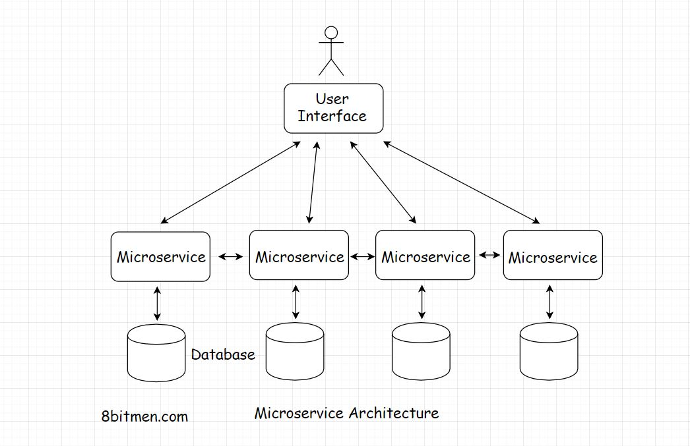

In this lesson, we will learn about fault tolerance &amp; designing a HA fault tolerant service. 

We'll cover the following
<svg xmlns="http://www.w3.org/2000/svg" width="24" height="24" viewBox="0 0 24 24" fill="none" stroke="currentColor" stroke-width="2" stroke-linecap="round" stroke-linejoin="round"><polyline points="18 15 12 9 6 15"></polyline></svg>

<ul>
<li>
<ul>
<li><a href="#what-is-fault-tolerance">What is Fault Tolerance?</a></li>
</ul>
</li>
<li>
<ul>
<li><a href="#designing-a-highly-available-fault-tolerant-service-architecture">Designing A Highly Available Fault-Tolerant Service – Architecture</a></li>
</ul>
</li>
</ul>

There are several approaches to achieve HA. The most important of them is to make the system fault-tolerant.

<h2 id="what-is-fault-tolerance" data-id="8b24a63826ce52bed02b881a7a753ced">What is Fault Tolerance? <a class="markdownIt-Anchor" href="#what-is-fault-tolerance">#</a></h2>
<blockquote data-id="2047e54f07e1b95fd0463e2098299806">

<em>Fault tolerance</em> is the ability of the system to stay up despite taking hits.

</blockquote>

A fault-tolerant system is equipped to handle faults. Being fault-tolerant is an essential element in designing life-critical systems.

A few of the <em>instances/nodes</em>, out of several, running the service go offline &amp; bounce back all the time. In case of these internal failures, the system could work at a reduced level but it will not go down entirely.

A very basic example of a system being fault-tolerant is a social networking application. In the case of backend node failures, a few services of the app such as image upload, post likes etc. may stop working. But the application as a whole will still be up. This approach is also technically known as <em>Fail Soft</em>.

<h2 id="designing-a-highly-available-fault-tolerant-service-architecture" data-id="4bb344a000b7e3c42dbd4e1b0dbbdf3c">Designing A Highly Available Fault-Tolerant Service – Architecture <a class="markdownIt-Anchor" href="#designing-a-highly-available-fault-tolerant-service-architecture">#</a></h2>

To achieve high availability at the application level, the entire massive service is architecturally broken down into smaller loosely coupled services called the <strong>micro-services</strong>.

There are many upsides of splitting a big monolith into several microservices, as it provides:

<ul data-id="b114a34c9edbe7b1dda929d96f9f3f19">
<li>Easier management</li>
<li>Easier development</li>
<li>Ease of adding new features</li>
<li>Ease of maintenance</li>
<li>High availability</li>
</ul>

Every microservice takes the onus of running different features of an application such as image upload, comment, instant messaging etc.

So, even if a few services go down the application as a whole is still up.

