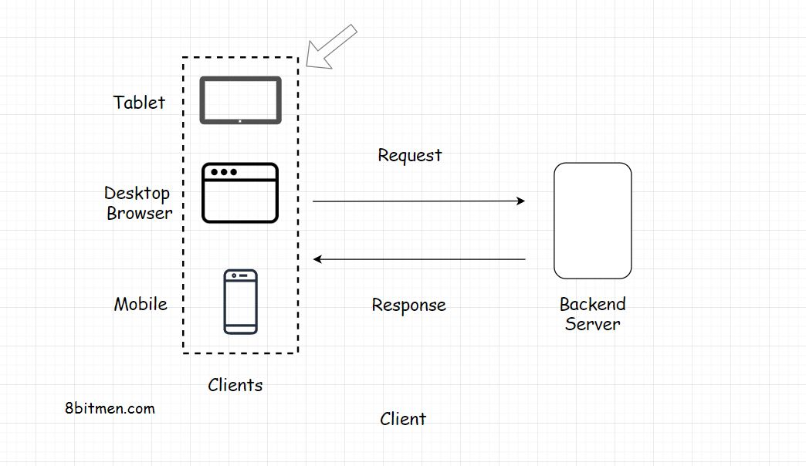

In this lesson, we will explore the Client component of the Client-Server Architecture.

We'll cover the following
<svg xmlns="http://www.w3.org/2000/svg" width="24" height="24" viewBox="0 0 24 24" fill="none" stroke="currentColor" stroke-width="2" stroke-linecap="round" stroke-linejoin="round"><polyline points="18 15 12 9 6 15"></polyline></svg>

<ul>
<li>
<ul>
<li><a href="#client">Client</a></li>
</ul>
</li>
<li>
<ul>
<li><a href="#technologies-used-to-implement-clients-in-web-applications">Technologies Used To Implement Clients In Web Applications</a></li>
</ul>
</li>
</ul>

<h2 id="client" data-id="75c309fa5532515c3853cc35517ccb83">Client <a class="markdownIt-Anchor" href="#client">#</a></h2>

The <em>client</em> holds our <em>user interface</em>. The user interface is the presentation part of the application. It’s written in <em>Html</em>, <em>JavaScript</em>, <em>CSS</em> and is responsible for the look &amp; feel of the application.

The user interface runs on the client. The client can be a mobile app, a desktop or a tablet like an <em>iPad</em>. It can also be a web-based console, running commands to interact with the backend server.

<h2 id="technologies-used-to-implement-clients-in-web-applications" data-id="9e95c8a68be7a7ce57cd8b2b98095242">Technologies Used To Implement Clients In Web Applications <a class="markdownIt-Anchor" href="#technologies-used-to-implement-clients-in-web-applications">#</a></h2>

In very simple terms, a client is the window to our application. In the industry, the <em>open-source</em> technologies popular for writing the web-based user interface are <em>ReactJS</em>, <em>AngularJS</em>, <em>VueJS</em>, <em>Jquery</em> etc. All these libraries use <em>JavaScript</em>.

There are a plethora of other technologies for writing the front-end too, I have just listed the popular ones for now.

Different platforms require different frameworks &amp; libraries to write front-end. For instance, mobile phones running <em>Android</em> would need a different set of tools, those running <em>Apple</em> or <em>Windows OS</em> would need a different set of tools.

If you are intrigued about the technologies popular in the industry <a href="https://insights.stackoverflow.com/survey/2019#technology" target="_blank">have a look at the developer survey run by StackOverflow for this year</a>

