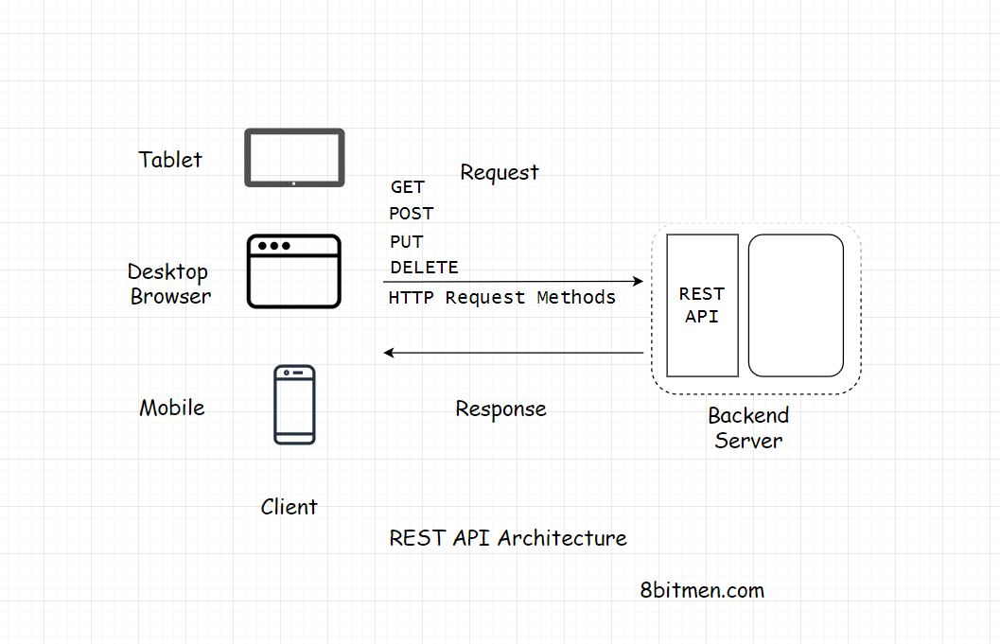

In this lesson, we will learn how communication takes place between the Client and the Server.

We'll cover the following
<svg xmlns="http://www.w3.org/2000/svg" width="24" height="24" viewBox="0 0 24 24" fill="none" stroke="currentColor" stroke-width="2" stroke-linecap="round" stroke-linejoin="round"><polyline points="18 15 12 9 6 15"></polyline></svg>

<ul>
<li>
<ul>
<li><a href="#request-response-model">Request-Response Model</a></li>
</ul>
</li>
<li>
<ul>
<li><a href="#http-protocol">HTTP Protocol</a></li>
</ul>
</li>
<li>
<ul>
<li><a href="#rest-api-api-endpoints">REST API &amp; API Endpoints</a></li>
</ul>
</li>
<li>
<ul>
<li><a href="#real-world-example-of-using-a-rest-api">Real World Example Of Using A REST API</a></li>
</ul>
</li>
</ul>

<h2 id="request-response-model" data-id="18f0b8727fed882d9e7266cef7233efc">Request-Response Model <a class="markdownIt-Anchor" href="#request-response-model">#</a></h2>

The client &amp; the server have a <em>request-response</em> model. The client sends the request &amp; the server responds with the data.

If there is no request, there is no response. Pretty simple right?

<h2 id="http-protocol" data-id="4ae6aa7feddb31ee760ab6cfffd69c88">HTTP Protocol <a class="markdownIt-Anchor" href="#http-protocol">#</a></h2>

The entire communication happens over the <em>HTTP</em> protocol. It is the protocol for data exchange over the World Wide Web. <em>HTTP</em> protocol is a <em>request-response</em> protocol that defines how information is transmitted across the web.

It’s a <em>stateless</em> protocol, every process over HTTP is executed independently &amp; has no knowledge of previous processes.

If you want to read more about the protocol, <a href="https://developer.mozilla.org/en-US/docs/Web/HTTP/Overview" target="_blank">this is a good resource on it</a>

Alright, moving on…

<h2 id="rest-api-api-endpoints" data-id="2118753b831ea618fbeacd9313b29956">REST API &amp; API Endpoints <a class="markdownIt-Anchor" href="#rest-api-api-endpoints">#</a></h2>

Speaking from the context of modern N-tier web applications, every client has to hit a <em>REST end-point</em> to fetch the data from the backend.

<blockquote data-id="69fe3031a18768fdf04a56f103d03cff">

<strong>Note:</strong> If you aren’t aware of the REST API &amp; the API Endpoints, I have discussed it in the next lesson in detail. I’ve brought up the terms in this lesson, just to give you a heads up on how modern distributed web applications communicate.

</blockquote>

The backend application code has a <em>REST-API</em> implemented which acts as an interface to the outside world requests. Every request be it from the client written by the business or the third-party developers which consume our data have to hit the REST-endpoints to fetch the data.

<h2 id="real-world-example-of-using-a-rest-api" data-id="0761e99b3cfbe13b08538a086bbb4388">Real World Example Of Using A REST API <a class="markdownIt-Anchor" href="#real-world-example-of-using-a-rest-api">#</a></h2>

For instance, let’s say we want to write an application which would keep track of the birthdays of all our Facebook friends &amp; send us a reminder a couple of days before the event date.

To implement this, the first step would be to get the data on the birthdays of all our Facebook friends.

We would write a client which would hit the Facebook Social Graph API which is a REST-API to get the data &amp; then run our business logic on the data.

Implementing a REST-based API has several advantages. Let’s delve into it in detail to have a deeper understanding.

