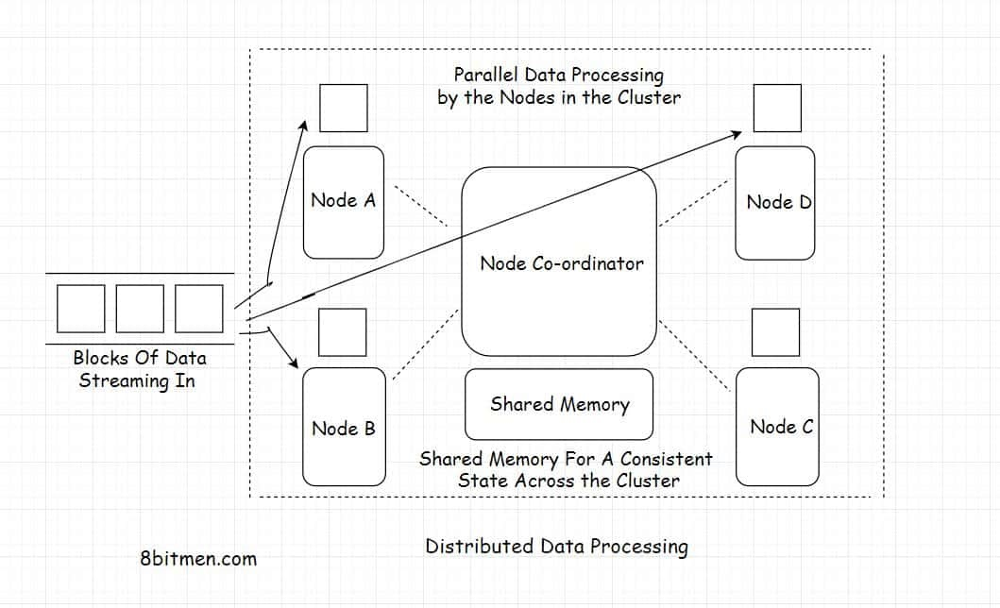

In this lesson, we will discuss distributed data processing and the technologies used for it.

We'll cover the following
<svg xmlns="http://www.w3.org/2000/svg" width="24" height="24" viewBox="0 0 24 24" fill="none" stroke="currentColor" stroke-width="2" stroke-linecap="round" stroke-linejoin="round"><polyline points="18 15 12 9 6 15"></polyline></svg>

<ul>
<li>
<ul>
<li><a href="#what-is-distributed-data-processing">What Is Distributed Data Processing?</a></li>
</ul>
</li>
<li>
<ul>
<li><a href="#distributed-data-processing-technologies">Distributed Data Processing Technologies</a></li>
</ul>
</li>
<li>
<ul>
<li>
<ul>
<li><a href="#mapreduce-apache-hadoop">MapReduce – Apache Hadoop</a></li>
</ul>
</li>
</ul>
</li>
<li>
<ul>
<li>
<ul>
<li><a href="#apache-spark">Apache Spark</a></li>
</ul>
</li>
</ul>
</li>
<li>
<ul>
<li>
<ul>
<li><a href="#apache-storm">Apache Storm</a></li>
</ul>
</li>
</ul>
</li>
<li>
<ul>
<li>
<ul>
<li><a href="#apache-kafka">Apache Kafka</a></li>
</ul>
</li>
</ul>
</li>
</ul>

Alright!! Fellas, this lesson is all about distributed data processing. I’ll talk about what it is? How different is it in comparison to a centralized data processing system? What are the architectures involved in it? And other similar topics.

So, let’s get on with it.

<h2 id="what-is-distributed-data-processing" data-id="5830406a52ee8c33dcc196b0471fd628">What Is Distributed Data Processing? <a class="markdownIt-Anchor" href="#what-is-distributed-data-processing">#</a></h2>
<blockquote data-id="a07ac5249c6de5a72959a05347d2ac2c">

<em>Distributed data processing</em> means diverging large amounts of data to several different nodes, running in a cluster, for parallel processing.

</blockquote>

All the nodes execute the task allotted parallelly, working in conjunction with each other co-ordinated by a node-co-ordinator. <em>Apache Zookeeper</em> is a pretty popular, de-facto, node co-ordinator used in the industry.

Since the nodes are distributed and the tasks are executed parallelly, this makes the entire set-up pretty <em>scalable</em> &amp; <em>highly available</em>. The workload can be scaled both horizontally &amp; vertically. Data is made <em>redundant</em> &amp; <em>replicated</em> across the cluster to avoid any sort of data loss.

Processing data in a distributed environment helps accomplish the task in a significantly less amount of time as opposed to when running it on a centralized data processing system.

In a distributed system the tasks are shared by several nodes on the contrary in a centralized system the tasks are queued in a queue to be processed one by one.

<h2 id="distributed-data-processing-technologies" data-id="443e104328c655a34154a0bae2ef9236">Distributed Data Processing Technologies <a class="markdownIt-Anchor" href="#distributed-data-processing-technologies">#</a></h2>

Here are some of the popular technologies, I’ve listed, that are used in the industry for large scale data processing.

<h3 id="mapreduce-apache-hadoop" data-id="0f71c5488fa28620cd059b2ff31f7e1e">MapReduce – Apache Hadoop <a class="markdownIt-Anchor" href="#mapreduce-apache-hadoop">#</a></h3>

<em>MapReduce</em> is a programming model written for managing distributed data processing across several different machines in a cluster, distributing tasks to several machines, running work in parallel, managing all the communication and data transfer within different parts of the system.

The <em>Map</em> part of the programming model involves sorting the data based on a parameter and the <em>Reduce</em> part involves summarizing the sorted data.

The most popular open-source implementation of the <em>MapReduce programming model</em> is <em>Apache Hadoop</em>.
The framework is used by all big guns in the industry to manage massive amounts of data in their system. It is used by Twitter for running analytics. It is used by Facebook for storing big data.

<h3 id="apache-spark" data-id="6afd30bed624c8f3a7fc268946f191d7">Apache Spark <a class="markdownIt-Anchor" href="#apache-spark">#</a></h3>

<em>Apache Spark</em> is an open-source cluster computing framework. It provides high performance for both batch &amp; real-time in-stream processing.
It can work with diverse data sources &amp; facilitates parallel execution of work in a cluster.

Spark has a cluster manager and distributed data storage. The cluster manager facilitates communication between different nodes running together in a cluster whereas the distributed storage facilitates storage of big data.
Spark seamlessly integrates with distributed data stores like <em>Cassandra, HDFS, MapReduce File System, Amazon S3</em> etc.

<h3 id="apache-storm" data-id="e1cb8ca22cc0fb2360f92b5e4fced75b">Apache Storm <a class="markdownIt-Anchor" href="#apache-storm">#</a></h3>

<em>Apache Storm</em> is a distributed stream processing framework. In the industry, it is primarily used for processing massive amounts of streaming data.
It has several different use cases such as real-time analytics, machine learning, distributed remote procedure calls etc.

<h3 id="apache-kafka" data-id="6a1af3c31ac2f0c75dc9ca145d3c5bc7">Apache Kafka <a class="markdownIt-Anchor" href="#apache-kafka">#</a></h3>

<em>Apache Kafka</em> is an open-source distributed stream processing &amp; messaging platform. It’s written using <em>Java</em> &amp; <em>Scala</em> &amp; was developed by <em>LinkedIn</em>.

The storage layer of Kafka involves a distributed scalable pub/sub message queue. It helps read &amp; write streams of data like a messaging system.

Kafka is used in the industry to develop real-time features such as notification platforms, managing streams of massive amounts of data, monitoring website activity &amp; metrics, messaging, log aggregation.

<em>Hadoop</em> is preferred for <em>batch processing</em> of data whereas <em>Spark, Kafka</em> &amp; <em>Storm</em> are preferred for processing real-time streaming data.

So, by now, I am sure you have a good idea of what data processing is. It’s use-cases in modern application development. The technologies involved etc.

Let’s have a look at a couple of architectures involved in the process. <em>Lambda</em> &amp; <em>Kappa</em>.

