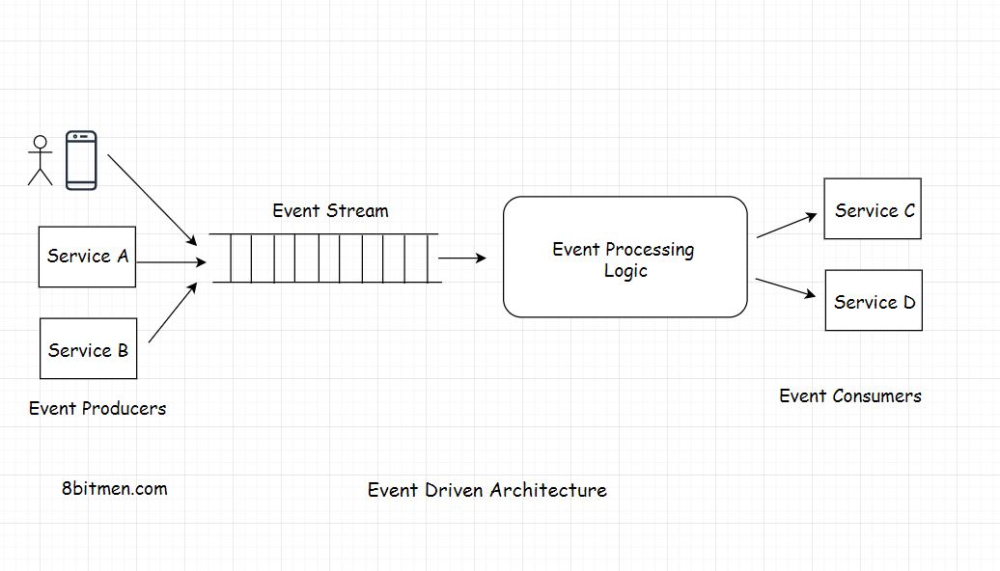

This lesson contains the second part of the discussion on the event-driven architecture. We will be continuing where we left off in the previous lesson.

We'll cover the following
<svg xmlns="http://www.w3.org/2000/svg" width="24" height="24" viewBox="0 0 24 24" fill="none" stroke="currentColor" stroke-width="2" stroke-linecap="round" stroke-linejoin="round"><polyline points="18 15 12 9 6 15"></polyline></svg>

<ul>
<li>
<ul>
<li><a href="#what-are-events">What Are Events?</a></li>
</ul>
</li>
<li>
<ul>
<li><a href="#event-driven-architecture">Event-Driven Architecture</a></li>
</ul>
</li>
<li>
<ul>
<li><a href="#technologies-for-implementing-the-event-driven-architecture">Technologies For Implementing the Event Driven Architecture</a></li>
</ul>
</li>
</ul>

<h2 id="what-are-events" data-id="5d7ff48bce43e1be7614adbb0836af86">What Are Events? <a class="markdownIt-Anchor" href="#what-are-events">#</a></h2>

There are generally two kinds of processes in applications <em>CPU intensive</em> &amp; <em>IO intensive</em>.
<em>IO</em> in the context of web applications means <em>events</em>. A large number of <em>IO</em> operations mean a lot of events occurring over a period of time. And an event can be anything from a tweet to a click of a button, an HTTP request, an ingested message, a change in the value of a variable etc.

We know that Web 2.0 real-time applications have a lot of events. For instance, there is a lot of request-response between the client and the server, typically in an online game, messaging app etc. <em>Events</em> happening too often is called a <em>stream of events</em>. In the previous chapter, we have already discussed how stream processing works.

<h2 id="event-driven-architecture" data-id="a4429397e8ef824e6cb5c134c9aff031">Event-Driven Architecture <a class="markdownIt-Anchor" href="#event-driven-architecture">#</a></h2>

<em>Non-blocking</em> architecture is also known as the <em>Reactive</em> or the <em>Event-driven</em> architecture. <em>Event-driven</em> architectures are pretty popular in the modern web application development.

Technologies like <em>NodeJS</em>, frameworks in the <em>Java</em> ecosystem like <em>Play</em>, <em><a href="http://Akka.io" target="_blank">Akka.io</a></em> are <em>non-blocking</em> in nature and are built for modern high <em>IO</em> scalable applications.

They are capable of handling a big number of concurrent connections with minimal resource consumption. Modern applications need a fully asynchronous model to scale. These modern web frameworks provide more reliable behaviour in a distributed environment. They are built to run on a cluster, handle large scale concurrent scenarios, tackle problems which generally occur in a clustered environment. They enable us to write code without worrying about handling <em>multi-threads, thread lock, out of memory issues</em> due to high <em>IO</em> etc.

Coming back to the <em>Event-driven reactive</em> architecture. It simply means reacting to the events occurring regularly. The code is written to react to the events as opposed to sequentially moving through the lines of codes.

I’ve already brought this up, that the sequence of events occurring over a period of time is called as a <em>stream of events</em>. In order to react to the events, the system has to continually monitor the stream. <em>Event-driven</em> architecture is all about processing <em>asynchronous data streams</em>. The application becomes inherently asynchronous.

<h2 id="technologies-for-implementing-the-event-driven-architecture" data-id="dcef10243392e6a1b3ea9ab7db4dda6f">Technologies For Implementing the Event Driven Architecture <a class="markdownIt-Anchor" href="#technologies-for-implementing-the-event-driven-architecture">#</a></h2>

With the advent of Web 2.0, people in the tech industry felt the need to evolve the technologies to be powerful enough to implement the modern web application use cases. <em>Spring framework</em> added <em>Spring Reactor</em> module to the core <em>Spring repo</em>. Developers wrote <em>NodeJS</em>, <em><a href="http://Akka.io" target="_blank">Akka.io</a></em>, <em>Play</em> etc.

So, you would have already figured that <em>Reactive event-driven</em> applications are difficult to implement with thread-based frameworks. As dealing with <em>threads</em>, shared <em>mutable state</em>, <em>locks</em> make things a lot more complex. In an <em>event-driven</em> system everything is treated as a <em>stream</em>. The level of abstraction is good, developers don’t have to worry about managing the low-level memory stuff.

And I am sure that you are well aware of the data streaming use cases that apply here, like handling a large number of transaction events, handling changing stock market prices, user events on an online shopping application etc.

<em>NodeJS</em> is a single-threaded <em>non-blocking</em> framework written to handle more <em>IO</em> intensive tasks. It has an <em>event loop</em> architecture. <a href="https://nodejs.org/fa/docs/guides/event-loop-timers-and-nexttick/" target="_blank">This is a good read on it.</a>

<a href="https://www.8bitmen.com/linkedin-real-time-architecture-how-does-linkedin-identify-its-users-online/" target="_blank"><em>LinkedIn</em> uses <em>Play</em> framework for identifying the online status of its users.</a>

At the same time, I want to assert this fact that the emergence of <em>non-blocking</em> tech does not mean that the traditional tech is obsolete. Every tech has it use cases.

<em>NodeJS</em> is not fit for <em>CPU intensive</em> tasks. <em>CPU intensive</em> operations are operations that require a good amount of computational power like for graphics rendering, running ML algorithms, handling data in enterprise systems etc. It would be a mistake to pick <em>NodeJS</em> for these purposes.

In the upcoming lessons, I will discuss the general guidelines to keep in mind when picking the server-side technology. That will give you more insight into how to pick the right backend technology?

