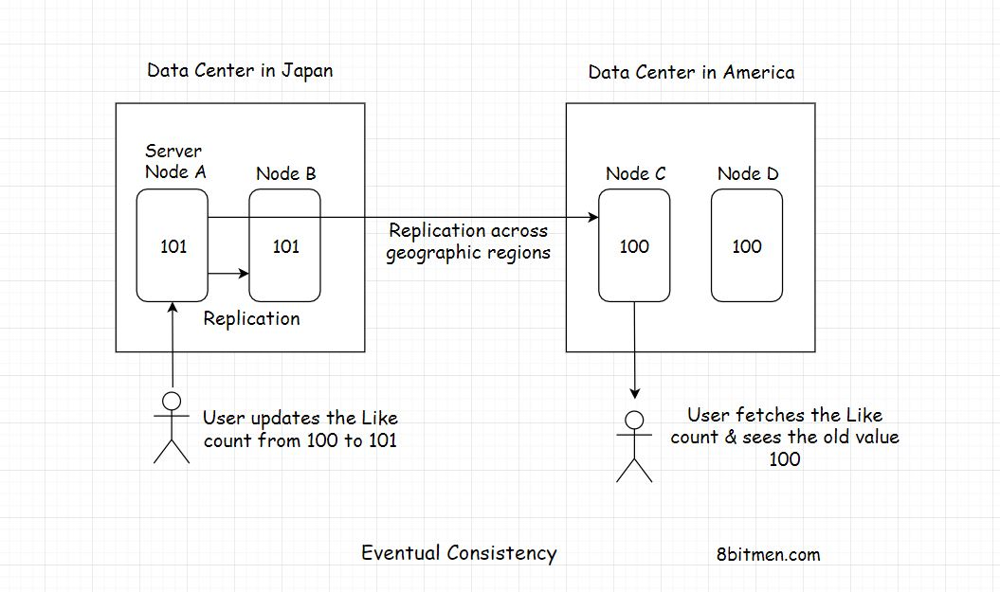

In this lesson, we will discuss Eventual Consistency.

We'll cover the following
<svg xmlns="http://www.w3.org/2000/svg" width="24" height="24" viewBox="0 0 24 24" fill="none" stroke="currentColor" stroke-width="2" stroke-linecap="round" stroke-linejoin="round"><polyline points="18 15 12 9 6 15"></polyline></svg>

<ul>
<li>
<ul>
<li><a href="#what-is-eventual-consistency">What Is Eventual Consistency?</a></li>
</ul>
</li>
<li>
<ul>
<li><a href="#real-world-use-case">Real World Use Case</a></li>
</ul>
</li>
</ul>

<h2 id="what-is-eventual-consistency" data-id="a13ea41bb50f81452d1cec0bc229187c">What Is Eventual Consistency? <a class="markdownIt-Anchor" href="#what-is-eventual-consistency">#</a></h2>

<em>Eventual consistency</em> is a consistency model which enables the data store to be <em>highly available</em>. It is also known as <em>optimistic replication</em> &amp; is key to distributed systems.

<em>So, how exactly does it work?</em>

We’ll understand this with the help of a use case.

<h2 id="real-world-use-case" data-id="ab04785d769545c547a79cec54c99cb5">Real World Use Case <a class="markdownIt-Anchor" href="#real-world-use-case">#</a></h2>

Think of a popular microblogging site deployed across the world in different geographical regions like Asia, America, Europe. Moreover, each geographical region has multiple data centre zones: North, East, West, South. Furthermore, each of the zones has multiple clusters which have multiple server nodes running.

So, we have many datastore nodes spread across the world which the micro-blogging site uses for persisting data.

Since there are so many nodes running, there is no <em>single point of failure</em>. The data store service is <em>highly available</em>. Even if a few nodes go down the persistence service as a whole is still up.

Alright, now let’s say a celebrity makes a post on the website which everybody starts liking around the world.

At a point in time, a user in Japan likes the post which increases the “Like” count of the post from say 100 to 101. At the same point in time, a user in America, in a different geographical zone clicks on the post and he sees the “Like” count as 100, not 101.

<em>Why did this happen?</em>

Simply, because the new updated value of the Post “Like” counter needs some time to move from Japan to America and update the server nodes running there.

Though the value of the counter at that point in time was 101, the user in America sees the old inconsistent value.

But when he refreshes his web page after a few seconds the “Like” counter value shows as 101. So, the data was initially inconsistent but eventually got consistent across the server nodes deployed around the world.
This is what <em>eventual consistency</em> is.

Let’s take it one step further, what if at the same point in time both the users in Japan and America <em>Like</em> the post, and a user in another geographic zone say Europe accesses the post.

All the nodes in different geographic zones have different post values. And they will take some time to reach a consensus.

The upside of eventual consistency is that the system can add new nodes on the fly without the need to block any of them, the nodes are available to the end-users to make an update at all times.

Millions of users across the world can update the values at the same time without having to wait for the system to reach a common final value across all nodes before they make an update. This feature enables the system to be <em>highly available</em>.

<em>Eventual consistency</em> is suitable for use cases where the accuracy of values doesn’t matter much like in the above-discussed use case.

Other use cases of eventual consistency can be when keeping the count of users watching a Live video stream online. When dealing with massive amounts of analytics data. A couple of counts up and down won’t matter much.

But there are use cases where the data has to be laser accurate like in banking, stock markets. We just cannot have our systems to be <em>Eventually Consistent</em>, we need <em>Strong Consistency</em>.

Let’s discuss it in the next lesson.

