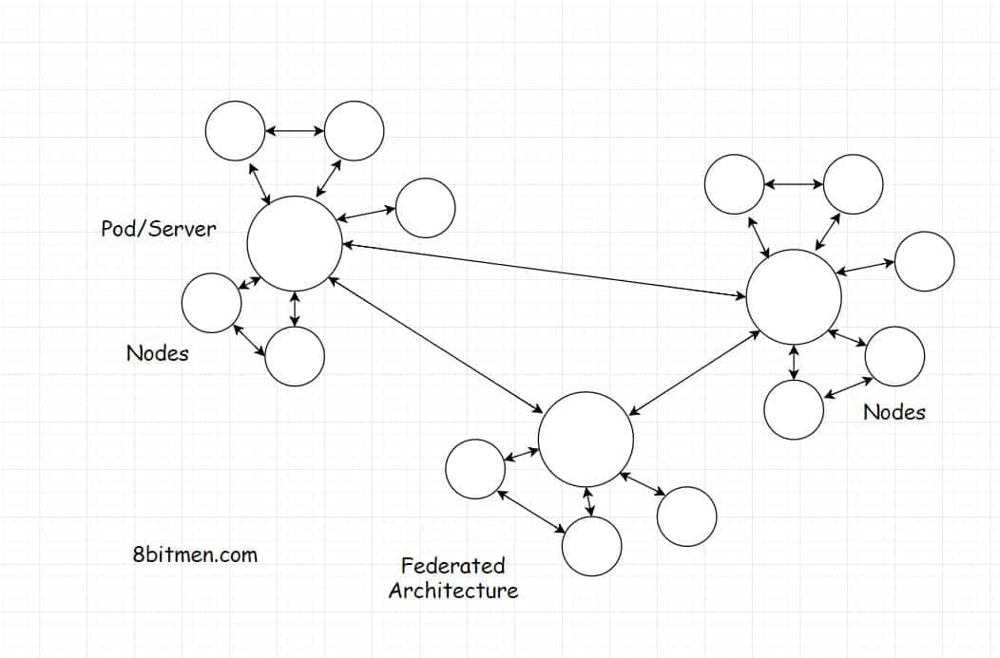

In this lesson, we will have an insight into the Federated Architecture.

We'll cover the following
<svg xmlns="http://www.w3.org/2000/svg" width="24" height="24" viewBox="0 0 24 24" fill="none" stroke="currentColor" stroke-width="2" stroke-linecap="round" stroke-linejoin="round"><polyline points="18 15 12 9 6 15"></polyline></svg>

<ul>
<li>
<ul>
<li><a href="#what-is-a-federated-architecture">What Is A Federated Architecture?</a></li>
</ul>
</li>
<li>
<ul>
<li><a href="#how-is-federated-architecture-implemented-in-decentralized-social-networks">How Is Federated Architecture Implemented In Decentralized Social Networks?</a></li>
</ul>
</li>
<li>
<ul>
<li><a href="#what-is-the-need-for-pods">What Is the Need For Pods?</a></li>
</ul>
</li>
</ul>

<h2 id="what-is-a-federated-architecture" data-id="b45c761443ab2acfcdc31558158cfab8">What Is A Federated Architecture? <a class="markdownIt-Anchor" href="#what-is-a-federated-architecture">#</a></h2>

<em>Federated architecture</em> is an extension to the <em>decentralized architecture</em>. It powers social networks like <em>Mastodon</em>, <em>Minds</em>, <em>Diaspora</em> etc.

The term <em>federated</em> in a general sense means a group of semi-autonomous entities exchanging information with each other. A real-world example of this would be looking at different states of a country which are managed by the state governments. They are partially self-governing &amp; exercise power to keep things running smoothly.
And then, those states governments share information with each other &amp; with a central government making a complete autonomous government.

This is just an example. The federated model from a technical standpoint is under continual research, development &amp; evolution. There are no standard rules. Developers, architects can have their own designs in place. After all, it’s all <em>decentralized</em>. Not under the control of any single entity.

<h2 id="how-is-federated-architecture-implemented-in-decentralized-social-networks" data-id="0197ad00e1f4e8037a3e422f217cb12d">How Is Federated Architecture Implemented In Decentralized Social Networks? <a class="markdownIt-Anchor" href="#how-is-federated-architecture-implemented-in-decentralized-social-networks">#</a></h2>

As shown in the diagram below. A federated network has entities called <em>servers</em> or <em>pods</em>. A large number of <em>nodes</em> subscribe to the <em>pods</em>. There are several <em>pods</em> in the network that are linked to each other &amp; share information with each other.

The <em>pods</em> can be hosted by individuals as it is ideally achieved in a decentralized network. As new <em>pods</em> are hosted &amp; introduced to the network, the network keeps growing.

In case if the link between a few <em>pods</em> breaks temporarily. The network is still up. <em>Nodes</em> can still communicate with each other via the pods they are subscribed to.

<h2 id="what-is-the-need-for-pods" data-id="c5014e31e167e8242c9edb9a94f25ccb">What Is the Need For Pods? <a class="markdownIt-Anchor" href="#what-is-the-need-for-pods">#</a></h2>

<em>What is the need for Pods? Can’t just the nodes be linked to each other like in a regular peer to peer network?</em>

<em>Pods</em> facilitate node discovery. In a <em>peer to peer</em> network, there is no way of discovering other nodes &amp; we would just sit in the dark if it weren’t for a centralized node registry or something.

The other way is to run a scan through the network &amp; try to discover other nodes. That’s a really time-consuming &amp; a tedious task. Why not just have a <em>pod</em> instead.

Okay!! So, Guys, I think I have given you a pretty good insight into the decentralized web.

Let’s move on to the next lesson where we talk about picking the right server-side technology.

