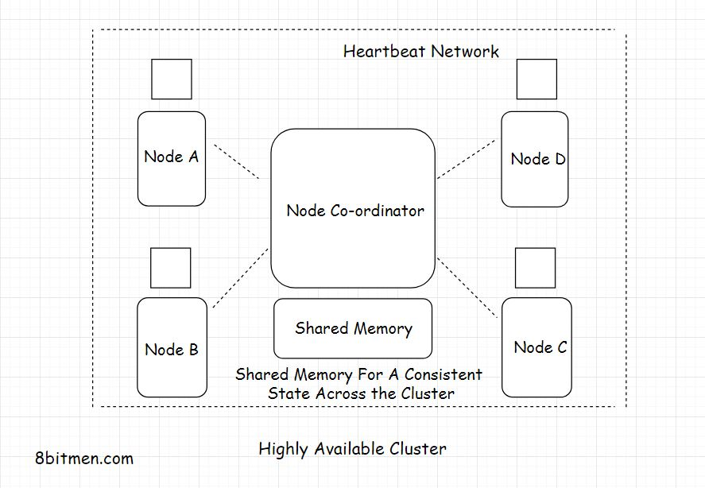

In this lesson, we will learn about High Availability Clustering.

Now, that we have a clear understanding of high availability, let’s talk a bit about the high availability cluster.

A <em>High Availability cluster</em> also known as the <em>Fail-Over cluster</em> contains a set of nodes running in conjunction with each other that ensures high availability of the service.

The nodes in the cluster are connected by a private network called the <em>Heartbeat network</em> that continuously monitors the health and the status of each node in the cluster.

A single state across all the nodes in a cluster is achieved with the help of a shared distributed memory &amp; a distributed co-ordination service like the <em>Zookeeper</em>.

To ensure the availability, HA clusters use several techniques such as <em>Disk mirroring/RAID Redundant Array Of Independent Disks</em>, redundant network connections, redundant electrical power etc. The network connections are made redundant so if the primary network goes down the backup network takes over.

Multiple HA clusters run together in one geographical zone ensuring minimum downtime &amp; continual service.

Alright, so now we have a pretty good understanding of scalability and high availability. These two concepts are crucial to software system design.

Moving on to the next chapter where we discuss monolithic &amp; microservices architecture.

