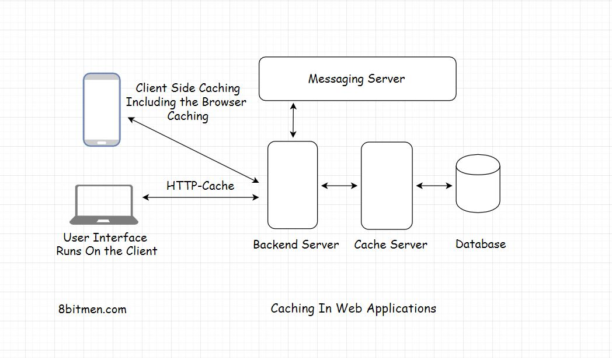

In this lesson, we will discuss how to tell if we need caching in our application.

We'll cover the following
<svg xmlns="http://www.w3.org/2000/svg" width="24" height="24" viewBox="0 0 24 24" fill="none" stroke="currentColor" stroke-width="2" stroke-linecap="round" stroke-linejoin="round"><polyline points="18 15 12 9 6 15"></polyline></svg>

<ul>
<li>
<ul>
<li><a href="#different-components-in-the-application-architecture-where-the-cache-can-be-used">Different Components In the Application Architecture Where the Cache Can Be Used</a></li>
</ul>
</li>
</ul>

First up, it’s always a good idea to use a cache as opposed to not using it. It doesn’t do any harm. It can be used at any layer of the application &amp; there are no ground rules as to where it can and cannot be applied.

The most common usage of caching is database caching. Caching helps alleviate the stress on the database by intercepting the requests being routed to the database for data.

The cache then returns all the frequently accessed data. Thus, cutting down the load on the database by notches.

<h2 id="different-components-in-the-application-architecture-where-the-cache-can-be-used" data-id="b782e127a8edec932988108ee994f3f4">Different Components In the Application Architecture Where the Cache Can Be Used <a class="markdownIt-Anchor" href="#different-components-in-the-application-architecture-where-the-cache-can-be-used">#</a></h2>

Across the architecture of our application, we can use caching at multiple places. Caching is used in the client browser to cache static data. It is used with the database to intercept all the data requests, in the REST API implementation etc.

Besides these places, I would suggest you to look for patterns. We can always cache the frequently accessed content on our website, be it from any component. There is no need to compute stuff over and over when it can be cached.

Think of <em>Joins</em> in relational databases. They are notorious for making the response slow. More <em>Joins</em> means more latency. A cache can avert the need for running <em>joins</em> every time just by storing the data in demand. Now imagine how much would this mechanism speed up our application.

Also, even if the database goes down for a while. The users won’t notice it as the cache would continue to serve the data requests.

Caching is also the core of the <em>HTTP</em> protocol. <a href="https://developers.google.com/web/fundamentals/performance/optimizing-content-efficiency/http-caching" target="_blank">This is a good resource to read more about it.</a>

We can store user sessions in a cache. It can be implemented at any layer of an application be it at the OS level, at the network level, CDN or the database.

You might remember, we talked about the <em>Key-value</em> data stores in the database lesson. They are primarily used to implement caching in web applications.

They can be used for <em>cross-module communication</em> in a <em>microservices</em> architecture by saving the shared data which is commonly accessed by all the services. It acts as a backbone for the <em>microservice</em> communication.

<em>Key-value</em> data stores via caching are also widely used in <em>in-memory data stream processing</em> and running <em>analytics</em>.

