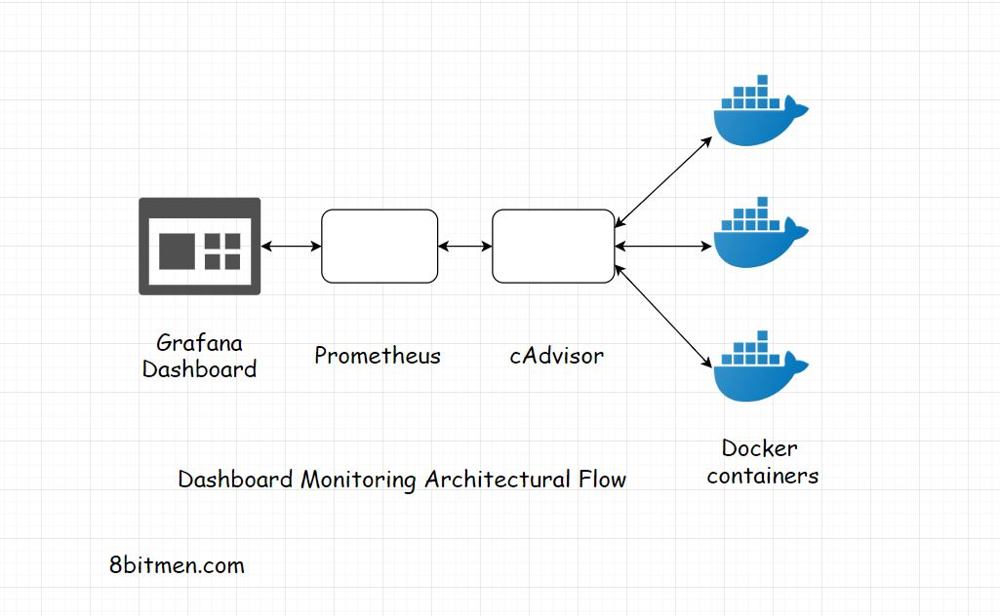

In this lesson, we will learn how we can improve &amp; test the scalability of our application.

We'll cover the following
<svg xmlns="http://www.w3.org/2000/svg" width="24" height="24" viewBox="0 0 24 24" fill="none" stroke="currentColor" stroke-width="2" stroke-linecap="round" stroke-linejoin="round"><polyline points="18 15 12 9 6 15"></polyline></svg>

<ul>
<li>
<ul>
<li><a href="#tuning-the-performance-of-the-application-enabling-it-to-scale-better">Tuning The Performance Of The Application – Enabling It To Scale Better</a>
<ul>
<li><a href="#profiling">Profiling</a></li>
<li><a href="#caching">Caching</a></li>
<li><a href="#cdn-content-delivery-network">CDN (Content Delivery Network)</a></li>
<li><a href="#data-compression">Data Compression</a></li>
<li><a href="#avoid-unnecessary-client-server-requests">Avoid Unnecessary Client Server Requests</a></li>
</ul>
</li>
</ul>
</li>
<li>
<ul>
<li><a href="#testing-the-scalability-of-our-application">Testing the Scalability Of Our Application</a></li>
</ul>
</li>
</ul>

Here are some of the common &amp; the best strategies to fine-tune the performance of our web application. If the application is performance-optimized it can withstand more traffic load with less resource consumption as opposed to an application that is not optimized for performance.

Now you might be thinking why am I talking about <em>performance</em> when I should be talking about <em>scalability</em>?

Well, the application’s performance is directly proportional to scalability. If an application is not performant it will certainly not scale well. These best practices can be implemented even before the real pre-production testing is done on the application.

So, here we go.

<h2 id="tuning-the-performance-of-the-application-enabling-it-to-scale-better" data-id="b58e7877b4a432ed1e0ab95714f7ec63">Tuning The Performance Of The Application – Enabling It To Scale Better <a class="markdownIt-Anchor" href="#tuning-the-performance-of-the-application-enabling-it-to-scale-better">#</a></h2>
<h3 id="profiling" data-id="fde9273808715ec77fb61010793f22f3">Profiling <a class="markdownIt-Anchor" href="#profiling">#</a></h3>

<em>Profile</em> the hell out. Run <em>application profiler</em>, <em>code profiler</em>. See which processes are taking too long, eating up too much resources. Find out the bottlenecks. Get rid of them.

<em>Profiling</em> is the dynamic analysis of our code. It helps us measure the space and the time complexity of our code &amp; enables us to figure out issues like concurrency errors, memory errors &amp; robustness &amp; safety of the program. <a href="https://en.wikipedia.org/wiki/List_of_performance_analysis_tools" target="_blank">This Wikipedia resource contains a good list of performance analysis tools used in the industry</a>

<h3 id="caching" data-id="8330f29f6da6e8e986662b9ac8ebb44b">Caching <a class="markdownIt-Anchor" href="#caching">#</a></h3>

<em>Cache</em> wisely. Cache everywhere. Cache all the static content. Hit the database only when it is really required. Try to serve all the read requests from the cache. Use a write-through cache.

<h3 id="cdn-content-delivery-network" data-id="ae003bf0f41a5414c15e0ca352ac1f95">CDN (Content Delivery Network) <a class="markdownIt-Anchor" href="#cdn-content-delivery-network">#</a></h3>

Use a <em>CDN</em>. Using a CDN further reduces the latency of the application due to the proximity of the data from the requesting user.

<h3 id="data-compression" data-id="17e2ac5f405f5ee493feb570ce85e71d">Data Compression <a class="markdownIt-Anchor" href="#data-compression">#</a></h3>

<em>Compress data</em>. Use apt compression algorithms to compress data. Store data in the compressed form. As compressed data consumes less bandwidth, consequently, the download speed of the data on the client will be faster.

<h3 id="avoid-unnecessary-client-server-requests" data-id="9f469d11f5c8cfa2a8741d531c86c79b">Avoid Unnecessary Client Server Requests <a class="markdownIt-Anchor" href="#avoid-unnecessary-client-server-requests">#</a></h3>

<em>Avoid unnecessary round trips</em> between the client &amp; server. Try to club multiple requests into one.

These are a few of the things we should keep in mind in context to the performance of the application.

<h2 id="testing-the-scalability-of-our-application" data-id="2a565c388cbda41f521568b41ecda5e6">Testing the Scalability Of Our Application <a class="markdownIt-Anchor" href="#testing-the-scalability-of-our-application">#</a></h2>

Once we are done with the basic performance testing of the application, it is time for capacity planning, provisioning the right amount of hardware &amp; computing power.

The right approach for testing the application for scalability largely depends on the design of our system. There is no definite formula for that. Testing can be performed at both the hardware and the software level. Different services &amp; components need to be tested both individually and collectively.

During the scalability testing, different system parameters are taken into account such as the <em>CPU usage, network bandwidth consumption, throughput, the number of requests processed within a stipulated time, latency, memory usage of the program, end-user experience when the system is under heavy load</em> etc.

In this testing phase, simulated traffic is routed to the system, to study how the system behaves under the heavy load, how the application scales under the heavy load. Contingencies are planned for unforeseen situations.

As per the anticipated traffic, appropriate hardware &amp; the computational power is provisioned to handle the traffic smoothly with some buffer.

Several <em>load</em> &amp; <em>stress</em> tests are run on the application. Tools like <em>JMeter</em> are pretty popular for running concurrent user test on the application if you are working on a <em>Java</em> ecosystem. There are a lot of cloud-based testing tools available that help us simulate tests scenarios just with a few mouse clicks.

Businesses test for scalability all the time to get their systems ready to handle the traffic surge. If it’s a sports website it would prepare itself for the sports event day, if it’s an e-commerce website it would make itself ready for the festival season.

Read <a href="https://engineering.fb.com/production-engineering/how-production-engineers-support-global-events-on-facebook/" target="_blank">how production engineers support global events on Facebook.</a>

Also, <a href="https://www.8bitmen.com/how-hotstar-scaled-with-10-3-million-concurrent-users-an-architectural-insight/" target="_blank">how Hotstar a video streaming service scaled with over 10 million concurrent users</a>

In the industry tech like <em>Cadvisor</em>, <em>Prometheus</em> and <em>Grafana</em> are pretty popular for tracking the system via web-based dashboards.

I’ve written an article on it in case you want to <a href="https://www.8bitmen.com/what-is-grafana-why-use-it-everything-you-should-know-about-it/" target="_blank">read more about the pre-production monitoring.</a>

