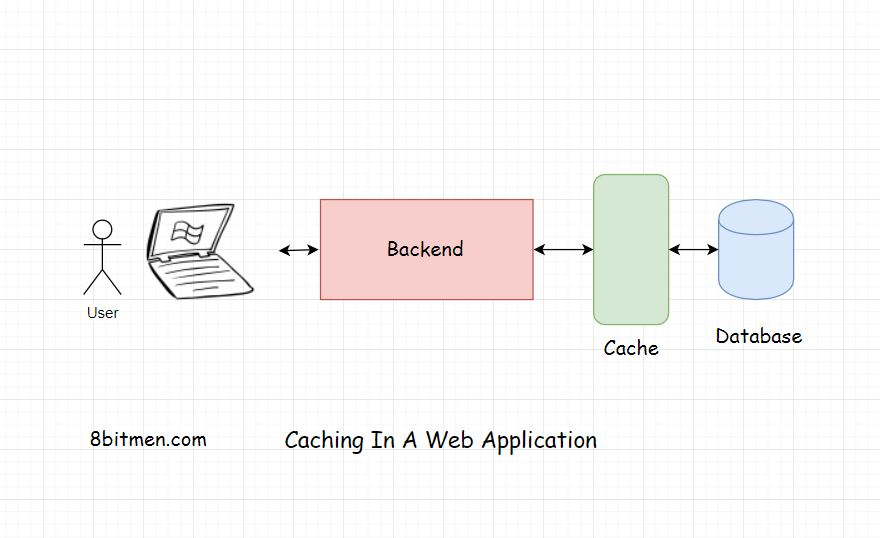

In this lesson, we will get introduced to the concept of caching and why it is important for performance.

We'll cover the following
<svg xmlns="http://www.w3.org/2000/svg" width="24" height="24" viewBox="0 0 24 24" fill="none" stroke="currentColor" stroke-width="2" stroke-linecap="round" stroke-linejoin="round"><polyline points="18 15 12 9 6 15"></polyline></svg>

<ul>
<li>
<ul>
<li><a href="#what-is-caching">What Is Caching?</a></li>
</ul>
</li>
<li>
<ul>
<li><a href="#caching-dynamic-data">Caching Dynamic Data</a></li>
</ul>
</li>
<li>
<ul>
<li><a href="#caching-static-data">Caching Static Data</a></li>
</ul>
</li>
</ul>

Hmmm… before beginning with this lesson, I want to ask you a question. When you visit a website and request certain data from the server. How long do you wait for the response?

5 seconds, 10 seconds, 15 seconds, 30 seconds? I know, I know, I am pushing it… 45? What? Still no response…

And then you finally bounce off &amp; visit another website for your answer. We are impatient creatures; we need our answers quick. This makes caching vital to applications to prevent users from bouncing off to other websites, all the time.

<h2 id="what-is-caching" data-id="6058d6746885b8a7f91182122ce271ce">What Is Caching? <a class="markdownIt-Anchor" href="#what-is-caching">#</a></h2>
<blockquote data-id="322e17668d607703de17bdeff5b3bd72">

<em>Caching</em> is key to the performance of any kind of application. It ensures <em>low latency</em> and <em>high throughput</em>. An application with caching will certainly do better than an application without caching, simply because it returns the response in less time as opposed to the application without a cache implemented.

</blockquote>

Implementing caching in a web application simply means copying frequently accessed data from the database which is <em>disk-based</em> hardware and storing it in <em>RAM Random Access Memory</em> hardware.

<em>RAM-based</em> hardware provides faster access than the disk-based hardware. As I said earlier it ensures low latency and high throughput.
Throughput means the number of network calls i.e. <em>request-response</em> between the client and the server within a stipulated time.

<em>RAM-based</em> hardware is capable of handling more requests than the <em>disk-based</em> hardware, on which the databases run.

<h2 id="caching-dynamic-data" data-id="a5c797f9ed3029c0bccd1867f75853c4">Caching Dynamic Data <a class="markdownIt-Anchor" href="#caching-dynamic-data">#</a></h2>

With caching we can cache both the <em>static</em> data and the <em>dynamic</em> data. Dynamic data is the data which changes more often, it has an expiry time or a <em>TTL</em> “Time To Live”. After the <em>TTL</em> ends, the data is purged from the cache and the newly updated data is stored in it. This process is known as <em>Cache Invalidation</em>.

<h2 id="caching-static-data" data-id="4272972903cd5bbf5324ec175a8c16fa">Caching Static Data <a class="markdownIt-Anchor" href="#caching-static-data">#</a></h2>

<em>Static</em> data consists of images, font files, CSS &amp; other similar files. This is the kind of data which doesn’t change often &amp; can easily be cached on the client-side in the browser or their local memory. Also, on the CDNs the Content Delivery Networks.

Caching also helps applications maintain their expected behaviour during network interruptions.

In the next lesson, let’s understand how do we figure if we really need a cache in our applications?

