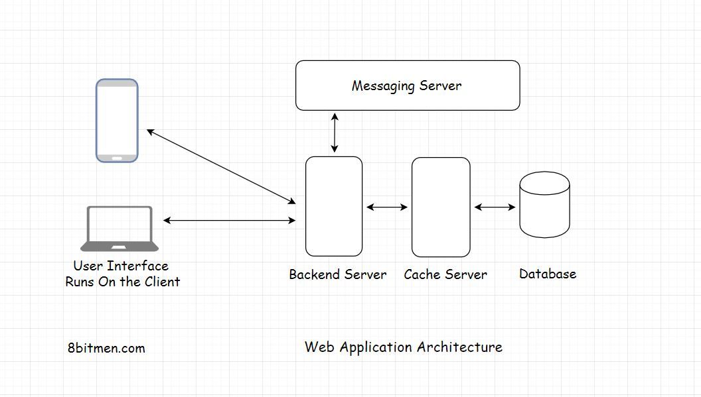

This lesson gives an overview of the different topics we will cover in this chapter. Also, we will learn what is a Tier &amp; it’s components?

We'll cover the following
<svg xmlns="http://www.w3.org/2000/svg" width="24" height="24" viewBox="0 0 24 24" fill="none" stroke="currentColor" stroke-width="2" stroke-linecap="round" stroke-linejoin="round"><polyline points="18 15 12 9 6 15"></polyline></svg>

<ul>
<li>
<ul>
<li><a href="#what-is-a-tier">What Is A Tier?</a></li>
</ul>
</li>
</ul>

I’ll begin the course by discussing different tiers involved in the software architectural landscape. This is like a bird’s eye view of the realm of software architecture &amp; is important to be understood well.

This chapter will help us understand:

<ul data-id="3dceb6c89400efb1f2f220bca6a4fbf4">
<li>What is a <em>Tier</em>?</li>
<li>Why do software applications have different <em>tiers</em>? What is the need for them?</li>
<li>How do I decide how many <em>tiers</em> should my application have?</li>
</ul>

<h2 id="what-is-a-tier" data-id="2f6d15d6c6c13273b497146397cfd543">What Is A Tier? <a class="markdownIt-Anchor" href="#what-is-a-tier">#</a></h2>

Think of a <em>tier</em> as a logical separation of components in an application or a service. And when I say separation, I mean physical separation at the component level, not the code level.

<strong>What do I mean by components?</strong>

<ul data-id="073c80cc21aba6315095fc816d13f88c">
<li><em>Database</em></li>
<li><em>Backend application server</em></li>
<li><em>User interface</em></li>
<li><em>Messaging</em></li>
<li><em>Caching</em></li>
</ul>

These are the different components that make up a <em>web service</em>.

Now let’s have a look at the different types of tiers &amp; their real-life examples.

