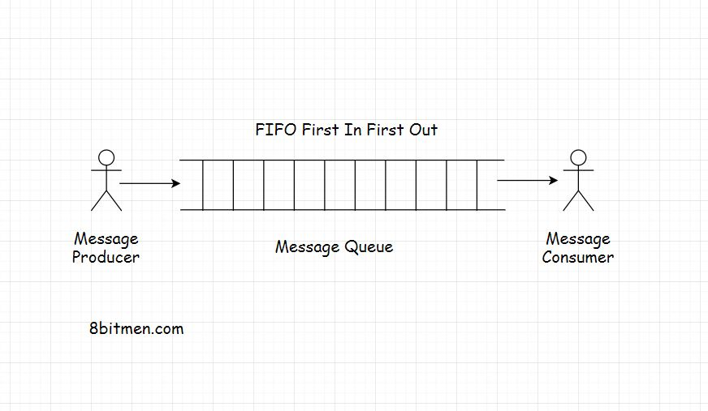

In this lesson, we will learn about the message queues and their functionalities.

We'll cover the following
<svg xmlns="http://www.w3.org/2000/svg" width="24" height="24" viewBox="0 0 24 24" fill="none" stroke="currentColor" stroke-width="2" stroke-linecap="round" stroke-linejoin="round"><polyline points="18 15 12 9 6 15"></polyline></svg>

<ul>
<li>
<ul>
<li><a href="#what-is-a-message-queue">What Is A Message Queue?</a></li>
</ul>
</li>
<li>
<ul>
<li><a href="#features-of-a-message-queue">Features Of A Message Queue</a></li>
</ul>
</li>
<li>
<ul>
<li><a href="#real-world-example-of-a-message-queue">Real World Example Of A Message Queue</a></li>
</ul>
</li>
<li>
<ul>
<li><a href="#message-queue-in-running-batch-jobs">Message Queue In Running Batch Jobs</a></li>
</ul>
</li>
</ul>

<h2 id="what-is-a-message-queue" data-id="35004a50d7fa15f37861ed4d155f14d5">What Is A Message Queue? <a class="markdownIt-Anchor" href="#what-is-a-message-queue">#</a></h2>
<blockquote data-id="4478421a64e68df6e3ee2dd52544cbde">

Message queue as the name says is a <em>queue</em> which routes messages from the source to the destination or we can say from the sender to the receiver.

</blockquote>

Since it is a <em>queue</em> it follows the <em>FIFO (First in First Out)</em> policy. The message that is sent first is delivered first. Though messages do have a priority attached with them that makes the queue a <em>priority queue</em> but for now let’s keep things simple.

<h2 id="features-of-a-message-queue" data-id="6d5a294bee98f604de3b6f3ab6a044a5">Features Of A Message Queue <a class="markdownIt-Anchor" href="#features-of-a-message-queue">#</a></h2>

Message queues facilitate asynchronous behaviour. We have already learned what asynchronous behaviour is in the <em>AJAX</em> lesson. Asynchronous behaviour allows the modules to communicate with each other in the background without hindering their primary tasks.

We will understand the behaviour of message queues with the help of an example in a short while, for now, let’s have a quick look at the features of the message queues.

Message queues facilitate <em>cross-module communication</em> which is key in <em>service-oriented</em> or <em>microservices</em> architecture. It allows communication in a heterogeneous environment. They also provide temporary storage for storing messages until they are processed &amp; consumed by the consumer.

<h2 id="real-world-example-of-a-message-queue" data-id="94b2c840a081a08d4b841e127c78aca4">Real World Example Of A Message Queue <a class="markdownIt-Anchor" href="#real-world-example-of-a-message-queue">#</a></h2>

Think of email as an example, both the sender and receiver of the email don’t have to be online at the same moment to communicate with each other.
The sender sends an email, the message is temporarily stored on the message server until the recipient comes online and reads the message.

Message queues enable us to run background processes, tasks, batch jobs. Speaking of background processes, let’s understand this with the help of a use case.

Think of a user signing up on a portal. After he signs up, he is immediately allowed to navigate to the home page of the application, but the sign-up process isn’t complete yet. The system has to send a confirmation email to the registered email id of the user. Then the user has to click on the confirmation email for the confirmation of the sign-up event.

But the website cannot keep the user waiting until it sends the email to the user. Either he is allowed to navigate to the home page or he bounces off.  So, this task is assigned as an asynchronous background process to a message queue. It sends an email to the user for confirmation while the user continues to browse the website.

This is how a message queue can be used to add asynchronous behaviour to a web application. Message queues are also used to implement notification systems just like Facebook notifications. I’ll discuss that in the upcoming lessons.

<h2 id="message-queue-in-running-batch-jobs" data-id="6edc500940c46cb75ca2dfe32b795235">Message Queue In Running Batch Jobs <a class="markdownIt-Anchor" href="#message-queue-in-running-batch-jobs">#</a></h2>

Now coming to the batch jobs. Do you remember the scenario from the previous caching lesson where I discussed how I used the cache to cut down the application deployment costs?

The batch job which updated the stock prices at regular intervals in the database was run by a message queue.

So, by now I am sure we kind of have an idea what a message queue is why do we use it in applications.

So, we now have a basic understanding that there is a <em>queue</em>, there is a message sender also called the <em>producer</em> and there is a message receiver also called the <em>consumer</em>.

Both the <em>producer</em> and the <em>consumer</em> don’t have to reside on the same machine to communicate, that is pretty obvious.

In this routing of messages through the <em>queue</em>, we can define several rules based on our business requirements. Adding priority to the messages is one I pointed out. Other important features of queuing include message acknowledgements, retrying failed messages etc.

Speaking of the size of the queue, there is no definite size, it can be an infinite buffer, depending on the infrastructure the business has.

We’ll now look into the messaging models widely used in the industry, beginning with the <em>publish subscribe</em> message routing model, which is pretty popular in today’s online universe. Also, it is how we consume information at large.

