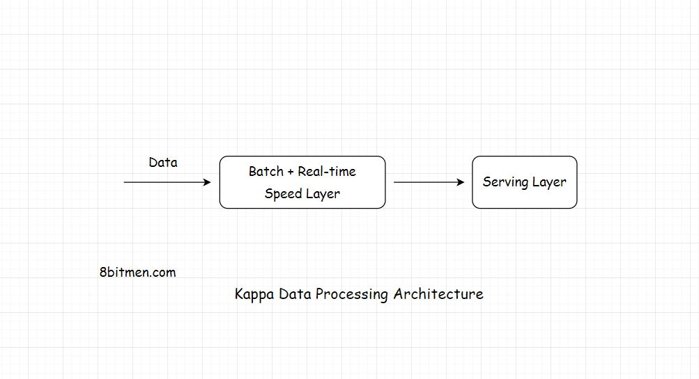

In this lesson, we will discuss the Kappa Architecture of data processing

We'll cover the following
<svg xmlns="http://www.w3.org/2000/svg" width="24" height="24" viewBox="0 0 24 24" fill="none" stroke="currentColor" stroke-width="2" stroke-linecap="round" stroke-linejoin="round"><polyline points="18 15 12 9 6 15"></polyline></svg>

<ul>
<li>
<ul>
<li><a href="#what-is-kappa-architecture">What Is Kappa Architecture?</a></li>
</ul>
</li>
<li>
<ul>
<li><a href="#layers-of-kappa-architecture">Layers Of Kappa Architecture</a></li>
</ul>
</li>
</ul>

<h2 id="what-is-kappa-architecture" data-id="05c1b72fd318fa3f6c4f579c9b2812ee">What Is Kappa Architecture? <a class="markdownIt-Anchor" href="#what-is-kappa-architecture">#</a></h2>
<blockquote data-id="744325457ccd5821d776ba5544b92e12">

In Kappa architecture, all the data flows through a single data streaming pipeline as opposed to the Lambda architecture which has different data streaming layers that converge into one.

</blockquote>

The architecture flows the data of both <em>real-time</em> &amp; <em>batch processing</em> through a single streaming pipeline reducing the complexity of not having to manage separate layers for processing data.

<h2 id="layers-of-kappa-architecture" data-id="e75a7cdcd9c6234b0d2db5ed552d4a05">Layers Of Kappa Architecture <a class="markdownIt-Anchor" href="#layers-of-kappa-architecture">#</a></h2>

<em>Kappa</em> contains only two layers. <em>Speed</em>, which is the streaming processing layer, &amp; the <em>Serving</em> which is the final layer.

<em>Kappa is not an alternative for Lambda</em>. Both the architectures have their use cases.

<em>Kappa</em> is preferred if the batch and the streaming analytics results are fairly identical in a system. <em>Lambda</em> is preferred if they are not.

Well, this concludes the stream processing chapter. Though the entire distributed data processing approach appears pretty smooth and efficient it’s important that we do not forget that setting up and managing a distributed data processing system is something not trivial. It’ requires years of work in perfecting the system. Also, a distributed system does not promise <em>Strong Consistency</em> of data.

With this being said, let’s move on to the next chapter where I talk about different kinds of architectures involved in the domain of software development.

