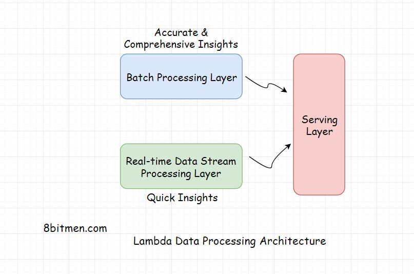

In this lesson, we will learn about Lambda Architecture of data processing.

We'll cover the following
<svg xmlns="http://www.w3.org/2000/svg" width="24" height="24" viewBox="0 0 24 24" fill="none" stroke="currentColor" stroke-width="2" stroke-linecap="round" stroke-linejoin="round"><polyline points="18 15 12 9 6 15"></polyline></svg>

<ul>
<li>
<ul>
<li><a href="#what-is-lambda-architecture">What Is Lambda Architecture?</a></li>
</ul>
</li>
<li>
<ul>
<li><a href="#layers-of-the-lambda-architecture">Layers Of the Lambda Architecture</a></li>
</ul>
</li>
</ul>

<h2 id="what-is-lambda-architecture" data-id="179cde40800b4a55e9b22b0b4ec51618">What Is Lambda Architecture? <a class="markdownIt-Anchor" href="#what-is-lambda-architecture">#</a></h2>
<blockquote data-id="4376cf9895f41baf34d1dea3017f8300">

<em>Lambda</em> is a distributed data processing architecture that leverages both the <em>batch</em> &amp; the <em>real-time</em> streaming data processing approaches to tackle the latency issues arising out of the <em>batch processing</em> approach. It joins the results from both the approaches before presenting it to the end user.

</blockquote>

<em>Batch processing</em> does take time considering the massive amount of data businesses have today but with it the accuracy of the approach is high &amp; the results are comprehensive.

On the contrary, <em>real-time streaming data processing</em> provides quick access to insights. In this scenario, the analytics is run over a small portion of data so the results are not that accurate &amp; comprehensive when compared to that of the batch approach.

<em>Lambda architecture</em> makes the most of the two approaches.

<h2 id="layers-of-the-lambda-architecture" data-id="48d35afa77abd18c5b2ad8d0740a1570">Layers Of the Lambda Architecture <a class="markdownIt-Anchor" href="#layers-of-the-lambda-architecture">#</a></h2>

The architecture has typically three layers:

<ul data-id="76e51a403b7873934b83cb0c68583e1c">
<li>Batch Layer</li>
<li>Speed Layer</li>
<li>Serving layer</li>
</ul>

The <em>Batch Layer</em> deals with the results acquired via batch processing the data. The <em>Speed layer</em> gets data from the real-time streaming data processing &amp; the <em>Serving layer</em> combines the results obtained from both the <em>Batch</em> &amp; the <em>Speed</em> layers.

