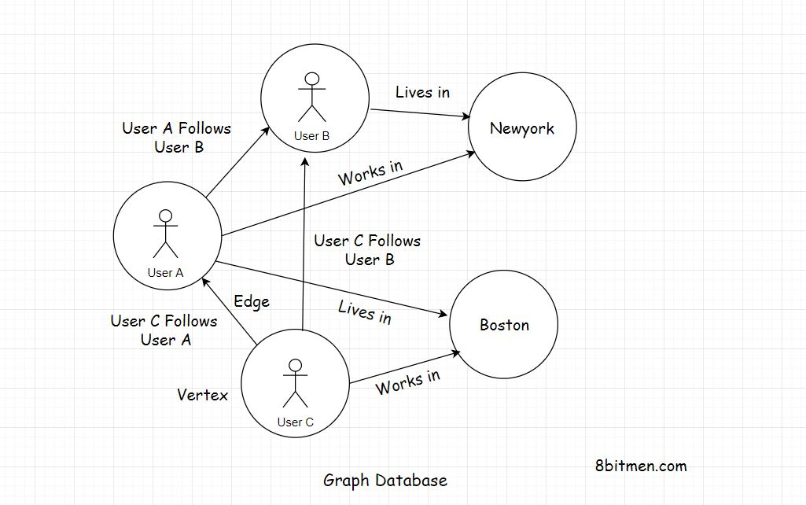
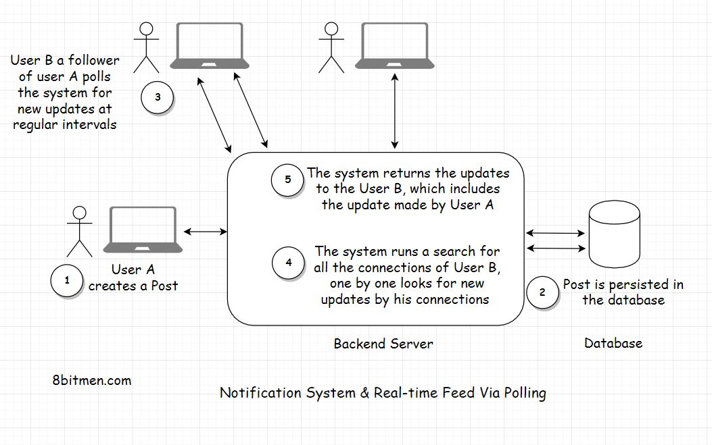
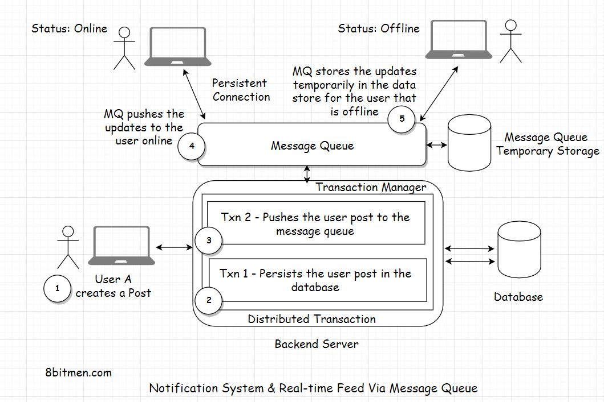

In this lesson, we will discuss how notification systems and real-time feeds are implemented using message queues.

We'll cover the following
<svg xmlns="http://www.w3.org/2000/svg" width="24" height="24" viewBox="0 0 24 24" fill="none" stroke="currentColor" stroke-width="2" stroke-linecap="round" stroke-linejoin="round"><polyline points="18 15 12 9 6 15"></polyline></svg>

<ul>
<li>
<ul>
<li><a href="#real-world-use-case">Real-World Use Case</a></li>
</ul>
</li>
<li>
<ul>
<li><a href="#pull-based-approach">Pull-Based Approach</a></li>
</ul>
</li>
<li>
<ul>
<li><a href="#push-based-approach">Push-Based Approach</a></li>
</ul>
</li>
</ul>

This is the part where we get an insight into how notification systems and real-time feeds are designed with the help of message queues. However, these modules are really complex in today’s modern Web 2.0 applications. They involve machine learning, understanding the user behaviour, recommending new relevant information &amp; integration of other modules with them etc. We won’t get into that level of complexity, simply because that’s not required.

I present a very simple use case so that we can wrap our heads around it.

Also, as we discuss this use case, I would like you to think from your own perspective. Imagine, how you would implement such a notification system from the bare bones. This will help you understand the concept better.

<h2 id="real-world-use-case" data-id="558de4e2ca7a02b7074c03f6f337122f">Real-World Use Case <a class="markdownIt-Anchor" href="#real-world-use-case">#</a></h2>

Alright!! So, imagine we are writing a social network like Facebook using a relational database and we would use a message queue to add the asynchronous behaviour to our application.

In the application, a user will have many friends and followers. This is a <em>many to many</em> relationship like a social graph. One user has many friends, and he would be a friend of many users. Just like as we discussed in the graph database lesson. Remember?

So, when a user creates a post on the website, we would persist it in the database. There will be one <em>User</em> table and another <em>Post</em> table. Since one user will create many posts, it will be a <em>one to many</em> relationship between the user and his posts.

Also, at the same time, as we persist the post in the database, we have to show the post created by the user on the home page of his friends and followers, even send the notification if needed.

How would you implement this? Pause &amp; think… before you read further.

<h2 id="pull-based-approach" data-id="fa21649c99f66ce305728831ab6c2c30">Pull-Based Approach <a class="markdownIt-Anchor" href="#pull-based-approach">#</a></h2>

<em>Alright!!</em>

One simple way to implement this without the message queue would be, for every user on the website, at regular short intervals poll the database if any of his connections have a new update.

For this, first, we will find all the connections of the user and then run a check for every connection one by one if there is a new post created by them.

If there are, the query will pull up all the new posts created by the connections of a user and display on his home page. We can also send the notifications to the user about the same, tracking the count of those with the help of a notification counter column in the <em>User</em> table &amp; adding an extra <em>AJAX</em> poll query from the client for new notifications.

<em>What do you think of this approach? Pretty simple &amp; straight forward right?</em>

There are two major downsides to this approach.

First, we are polling the database so often, this is expensive. It will consume a lot of bandwidth &amp; will also put a lot of unnecessary load on the database.

The second downside is, the display of the user post on the home page of his connection will not be in real-time. The posts won’t display until the database is polled. We may call this as real-time but is not really real-time.

<h2 id="push-based-approach" data-id="0a9a8d1f5d90cb13de10d4ef845f4d8e">Push-Based Approach <a class="markdownIt-Anchor" href="#push-based-approach">#</a></h2>

Let’s make our system more performant, instead of polling the database every now and then we will take the help of a message queue.

So, this time when a user creates a new post, it will have a <em>distributed transaction</em>. One transaction will update the database, and the other transaction will send the post payload to the message queue. <em>Payload</em> means the content of the message posted by the user.

Notification systems and real-time feeds establish a <em>persistent connection</em> with the database to facilitate real-time streaming of data. We have already been through this.

The message queue on receiving the message will asynchronously immediately push the post to the connections of the user which are online. There is no need for them to poll the database at regular intervals to check if the user has created a post.

We can also use the message queue temporary storage with a <em>TTL Time to wait</em> for the connections of the user to come online &amp; then push the updates to them. We can also have separate <em>Key-value</em> database to store the details of the user required to push the notifications to his connections. Like the ids of his connections and stuff. This would avert the need to even poll the database to get the connections of the user.

So, did you see how we transitioned from a <em>pull-based</em> mechanism to a <em>push-based</em> mechanism with the help of message queues? This would certainly spike the performance of the application and cut down a lot of resource consumption, thus saving truckloads of our hard-earned money.

Regarding the <em>distributed transactions</em>, it entirely depends on how we want to deal with it. Though the transactions are distributed, they can still work as a single unit.

If the database persistence fails, naturally, we will roll back the entire transaction. There won’t be any message push to the message queue either.

What if the message queue push fails? Do you want to roll-back the transaction? Or do you want to proceed? The decision entirely depends on you. How you want your system to behave.

Even if the message queue push fails, the message isn’t lost. It can still be persisted in the database.

When the user refreshes his home page you can write a query where he can poll the database for new updates. Take the polling approach, we discussed initially, as a backup.

Or you can totally rollback the transaction, even if the database persistence transaction is a success but the message queue push transaction fails. The post still hasn’t gone into the database yet as it is generally a two-phase commit. We can always write custom distributed transaction code or leverage the distributed transaction managers which the frameworks offer.

I can go on and on about it, till the minutest of the details. But it would just make the lesson unnecessarily lengthy. For now, I have just touched the surface, to help you understand how notification systems &amp; real-time feeds work.

Just like the post creation process, the same process or the flow repeats itself when the users trigger events like visiting a public place, eating at a restaurant etc. And the message queues push the events to the connections of the user.

When designing scalable systems, I would want to assert this fact that there is no perfect or best solution. The solution should serve us well, fulfil our business requirements. Optimization is an evolutionary process, so don’t sweat about it in the initial development cycles.

First, get the skeleton in place and then start optimizing notch by notch.

Recommended read - <a href="https://www.8bitmen.com/linkedin-real-time-architecture-how-does-linkedin-identify-its-users-online/" target="_blank">How Does LinkedIn Identify Its Users Online?</a>

