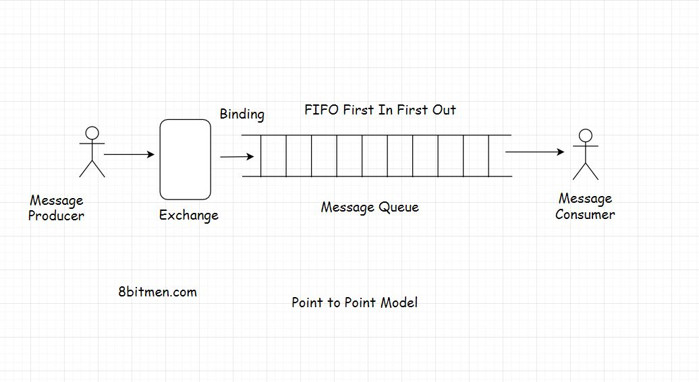

In this lesson, we will learn about the point to point messaging model, its applications, popular message queue protocols &amp; the technology used to implement them. 

We'll cover the following
<svg xmlns="http://www.w3.org/2000/svg" width="24" height="24" viewBox="0 0 24 24" fill="none" stroke="currentColor" stroke-width="2" stroke-linecap="round" stroke-linejoin="round"><polyline points="18 15 12 9 6 15"></polyline></svg>

<ul>
<li>
<ul>
<li><a href="#what-is-point-to-point-model">What Is Point to Point Model?</a></li>
</ul>
</li>
<li>
<ul>
<li><a href="#messaging-protocols">Messaging Protocols</a></li>
</ul>
</li>
<li>
<ul>
<li><a href="#technology-used-to-implement-the-messaging-protocols">Technology Used To Implement the Messaging Protocols</a></li>
</ul>
</li>
</ul>

<h2 id="what-is-point-to-point-model" data-id="a9fe42474645a7038def2b4b7c16a37f">What Is Point to Point Model? <a class="markdownIt-Anchor" href="#what-is-point-to-point-model">#</a></h2>
<blockquote data-id="430519467042412813ec35c1b7053757">

<em>Point to point</em> communication is a pretty simple use case where the message from the producer is consumed by only one consumer.

</blockquote>

It’s like a <em>one to one</em> relationship, a <em>publish-subscribe</em> model is a <em>one to many</em> relationship.

Though based on the business requirements we can set up multiple combinations in this messaging model, like adding multiple producers &amp; consumers to a queue. But at the end of the day, a message sent by the producer will be consumed by only one consumer. This is why it’s called a <em>point to point</em> queuing model. It’s not a broadcast of messages rather an entity to entity communication.

<h2 id="messaging-protocols" data-id="494bcf208d121aa181788e3377218b94">Messaging Protocols <a class="markdownIt-Anchor" href="#messaging-protocols">#</a></h2>

Speaking of the messaging protocols, there are two protocols popular when working with message queues. <a href="https://en.wikipedia.org/wiki/Advanced_Message_Queuing_Protocol" target="_blank">AMQP Advanced Message Queue Protocol</a> &amp; <a href="https://en.wikipedia.org/wiki/Streaming_Text_Oriented_Messaging_Protocol" target="_blank">STOMP Simple or Streaming Text Oriented Message Protocol</a>.

<h2 id="technology-used-to-implement-the-messaging-protocols" data-id="1edac0daece976610bfb68f1cb6a3346">Technology Used To Implement the Messaging Protocols <a class="markdownIt-Anchor" href="#technology-used-to-implement-the-messaging-protocols">#</a></h2>

Speaking of the queuing tech widely used in the industry, they are <em>RabbitMQ</em>, <em>ActiveMQ</em>, <em>Apache Kafka</em> etc.

So, Guys!! this is pretty much it on the queuing models. Now, let’s have an insight into how do notification systems work with message queues.

