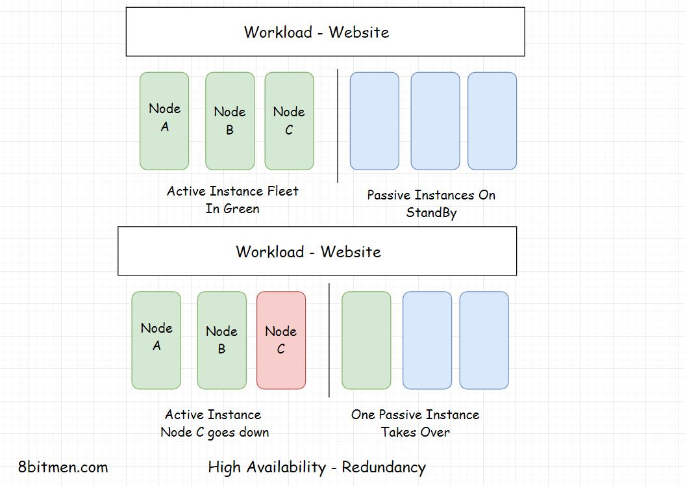

In this lesson, we will learn about Redundancy as a High Availability mechanism.

We'll cover the following
<svg xmlns="http://www.w3.org/2000/svg" width="24" height="24" viewBox="0 0 24 24" fill="none" stroke="currentColor" stroke-width="2" stroke-linecap="round" stroke-linejoin="round"><polyline points="18 15 12 9 6 15"></polyline></svg>

<ul>
<li>
<ul>
<li><a href="#redundancy-active-passive-ha-mode">Redundancy – Active-Passive HA Mode</a></li>
</ul>
</li>
<li>
<ul>
<li><a href="#getting-rid-of-single-points-of-failure">Getting Rid Of Single Points Of Failure</a></li>
</ul>
</li>
<li>
<ul>
<li><a href="#monitoring-automation">Monitoring &amp; Automation</a></li>
</ul>
</li>
</ul>

<h2 id="redundancy-active-passive-ha-mode" data-id="a65d9888463ede1920833953b0ce3549">Redundancy – Active-Passive HA Mode <a class="markdownIt-Anchor" href="#redundancy-active-passive-ha-mode">#</a></h2>
<blockquote data-id="fbae8051cadfd56e1f0279c7902d916d">

Redundancy is duplicating the components or instances &amp; keeping them on standby to take over in case the active instances go down. It’s the fail-safe, backup mechanism.

</blockquote>

In the above diagram, you can see the instances active &amp; on standby. The standby instances take over in case any of the active instances goes down.

This approach is also known as <em>Active-Passive HA mode</em>. An initial set of nodes are active &amp; a set of redundant nodes are passive, on standby. Active nodes get replaced by passive nodes, in case of failures.

There are systems like GPS, aircrafts, communication satellites which have zero downtime. The availability of these systems is ensured by making the components redundant.

<h2 id="getting-rid-of-single-points-of-failure" data-id="3ecc2c5506f467d11ba5f13c547c537a">Getting Rid Of Single Points Of Failure <a class="markdownIt-Anchor" href="#getting-rid-of-single-points-of-failure">#</a></h2>

Distributed systems got so popular solely due to the reason that with them, we could get rid of the single points of failure present in a monolithic architecture.

A large number of distributed nodes work in conjunction with each other to achieve a single synchronous application state.

When so many redundant nodes are deployed, there are no single points of failure in the system. In case a node goes down redundant nodes take its place. Thus, the system as a whole remains unimpacted.

Single points of failure at the application level mean bottlenecks. We should detect bottlenecks in performance testing &amp; get rid of them as soon as we can.

<h2 id="monitoring-automation" data-id="d8c6a28be146e6eda0a07563a162c470">Monitoring &amp; Automation <a class="markdownIt-Anchor" href="#monitoring-automation">#</a></h2>

Systems should be well monitored in real-time to detect any bottlenecks or single point of failures. Automation enables the instances to self-recover without any human intervention. It gives the instances the power of self-healing.

Also, the systems become intelligent enough to add or remove instances on the fly as per the requirements.

Since the most common cause of failures is human error, automation helps cut down failures to a big extent.

