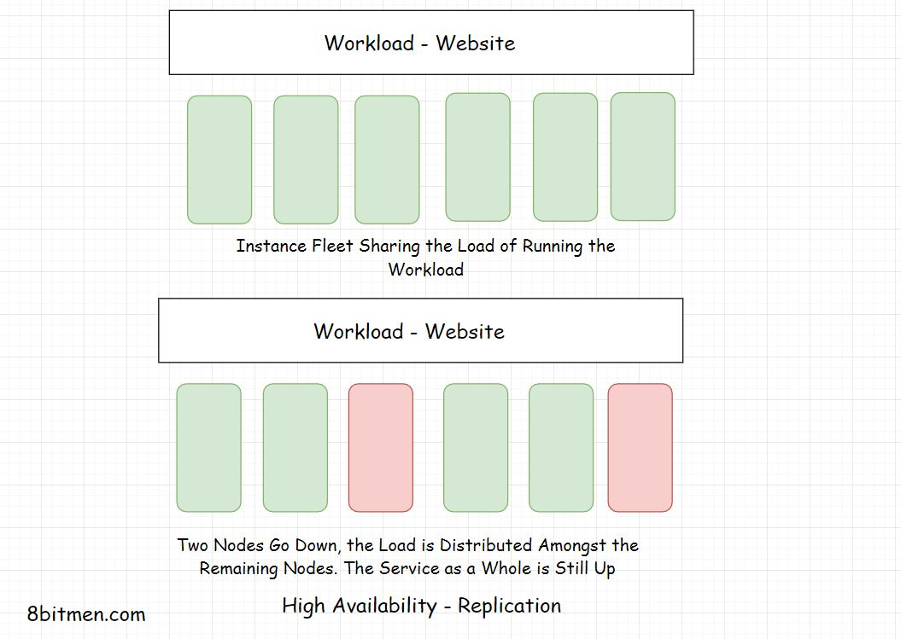

In this lesson, we will learn about Replication as a High Availability mechanism.

We'll cover the following
<svg xmlns="http://www.w3.org/2000/svg" width="24" height="24" viewBox="0 0 24 24" fill="none" stroke="currentColor" stroke-width="2" stroke-linecap="round" stroke-linejoin="round"><polyline points="18 15 12 9 6 15"></polyline></svg>

<ul>
<li>
<ul>
<li><a href="#replication-active-active-ha-mode">Replication – Active-Active HA Mode</a></li>
</ul>
</li>
<li>
<ul>
<li><a href="#geographical-distribution-of-workload">Geographical Distribution of Workload</a></li>
</ul>
</li>
</ul>

<h2 id="replication-active-active-ha-mode" data-id="ae8991f40070dee30a5da976ae8654cc">Replication – Active-Active HA Mode <a class="markdownIt-Anchor" href="#replication-active-active-ha-mode">#</a></h2>

Replication means having a number of similar nodes running the workload together. There are no standby or passive instances. When a single or a few nodes go down, the remaining nodes bear the load of the service. Think of this as load balancing.

This approach is also known as the <em>Active-Active High Availability</em> mode. In this approach, all the components of the system are active at any point in time.

<h2 id="geographical-distribution-of-workload" data-id="c6a48e5c9800ba720267af4e06fd8635">Geographical Distribution of Workload <a class="markdownIt-Anchor" href="#geographical-distribution-of-workload">#</a></h2>

As a contingency for natural disasters, data centre regional power outages &amp; other big-scale failures, workloads are spread across different data centres across the world in different geographical zones.

This avoids the single point of failure thing in context to a data centre. Also, the latency is reduced by quite an extent due to the proximity of data to the user.

All the highly available fault-tolerant design decisions are subjective to how critical the system is? What are the odds that the components will fail? Etc.

Businesses often use multi-cloud platforms to deploy their workloads which ensures further availability. If things go south with one cloud provider, they have another to fail back over.

