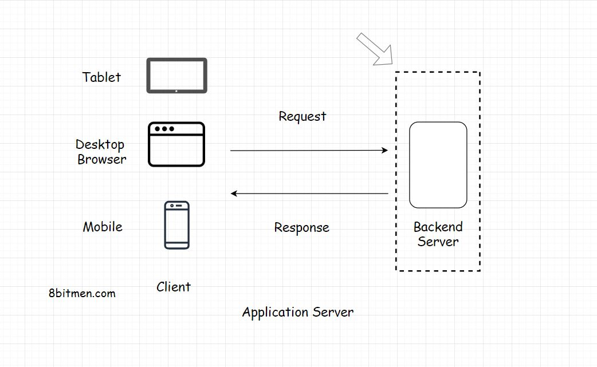

In this lesson, we will explore the Server component of the Client-Server Architecture.

We'll cover the following
<svg xmlns="http://www.w3.org/2000/svg" width="24" height="24" viewBox="0 0 24 24" fill="none" stroke="currentColor" stroke-width="2" stroke-linecap="round" stroke-linejoin="round"><polyline points="18 15 12 9 6 15"></polyline></svg>

<ul>
<li>
<ul>
<li><a href="#what-is-a-web-server">What is A Web Server?</a></li>
</ul>
</li>
<li>
<ul>
<li><a href="#server-side-rendering">Server-Side Rendering</a></li>
</ul>
</li>
</ul>

<h2 id="what-is-a-web-server" data-id="76b66bd0bdb584c3c383098747af897b">What is A Web Server? <a class="markdownIt-Anchor" href="#what-is-a-web-server">#</a></h2>
<blockquote data-id="2a7a8226fe5981610b7713d8a8fbfdfb">

The primary task of a web server is to receive the requests from the client &amp; provide the response after executing the business logic based on the request parameters received from the client.

</blockquote>

Every service, running online, needs a server to run. Servers running web applications are commonly known as the <em>application servers</em>.

Besides the <em>application servers</em>, there are other kinds of servers too with specific tasks assigned to them such as the:

<ul data-id="9f6925d796cf692afc5df2b0b885f22a">
<li><em>Proxy server</em></li>
<li><em>Mail server</em></li>
<li><em>File server</em></li>
<li><em>Virtual server</em></li>
</ul>

<em>The server configuration &amp; the type can differ depending on the use case</em>.

<ul data-id="a92fc89d1a9baa2a13470dda86ac14e8">
<li>

For instance, if we run a backend application code written in <em>Java</em>, we would pick <em>Apache Tomcat</em> or <em>Jetty</em>.

</li>
<li>

For simple use cases such as hosting websites, we would pick the <em>Apache HTTP Server</em>.

</li>
</ul>

In this lesson, we will stick to the <em>application server</em>.

All the components of a web application need a server to run. Be it a database, a message queue, a cache or any other component. In modern application development, even the user interface is hosted separately on a dedicated server.

<h2 id="server-side-rendering" data-id="bee2bbeda1242252e770d636dacc9565">Server-Side Rendering <a class="markdownIt-Anchor" href="#server-side-rendering">#</a></h2>

Often the developers use a server to render the user interface on the backend &amp; then send the rendered data to the client. The technique is known as <em>server-side rendering</em>. I will discuss the pros &amp; cons of <em>client-side</em> vs <em>server-side</em> rendering further down the course.

Now we have a fundamental understanding of both the client &amp; the server. Let’s delve into some of the concepts involved in the communication between them.

