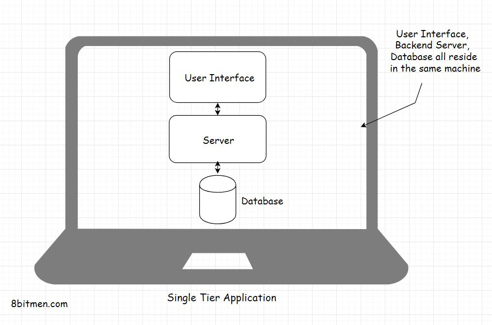

In this lesson, we will learn about the Single Tier applications.

We'll cover the following
<svg xmlns="http://www.w3.org/2000/svg" width="24" height="24" viewBox="0 0 24 24" fill="none" stroke="currentColor" stroke-width="2" stroke-linecap="round" stroke-linejoin="round"><polyline points="18 15 12 9 6 15"></polyline></svg>

<ul>
<li>
<ul>
<li><a href="#single-tier-applications">Single Tier Applications</a></li>
</ul>
</li>
<li>
<ul>
<li><a href="#advantages-of-single-tier-applications">Advantages Of Single Tier Applications</a></li>
</ul>
</li>
<li>
<ul>
<li><a href="#disadvantages-of-single-tier-applications">Disadvantages Of Single Tier Applications</a></li>
</ul>
</li>
</ul>

<h2 id="single-tier-applications" data-id="2fb0492240f630f4d3a86d0cfdf68b96">Single Tier Applications <a class="markdownIt-Anchor" href="#single-tier-applications">#</a></h2>
<blockquote data-id="5110ae648f5fd5bf47760b85bb1024bb">

A <em>single-tier</em> application is an application where the <em>user interface</em>, <em>backend business logic</em> &amp; the <em>database</em> all reside in the same machine.

</blockquote>

Typical examples of <em>single-tier</em> applications are desktop applications like <em>MS Office</em>, PC Games or an image editing software like <em>Gimp</em>.

<h2 id="advantages-of-single-tier-applications" data-id="9b6ce6a358c8780a22f1828c5432e1e3">Advantages Of Single Tier Applications <a class="markdownIt-Anchor" href="#advantages-of-single-tier-applications">#</a></h2>

The main upside of <em>single-tier</em> applications is they have no network latency since every component is located on the same machine. This adds up to the performance of the software.

There are no data requests to the backend server every now and then, which would make the user experience slow. In <em>single-tier</em> apps, the data is easily &amp; quickly available since it is located in the same machine.

Though it largely depends on how powerful the machine is &amp; the hardware requirements of the software, to gauge the real performance of a <em>single-tier</em> app.

Also, the data of the user stays in his machine &amp; doesn’t need to be transmitted over a network. This ensures data safety at the highest level.

<h2 id="disadvantages-of-single-tier-applications" data-id="33018d4017b6d15142358155cf695e18">Disadvantages Of Single Tier Applications <a class="markdownIt-Anchor" href="#disadvantages-of-single-tier-applications">#</a></h2>

One big downside of <em>single-tier</em> app is that the business has no control over the application. Once the software is shipped, no code or features changes can possibly be done until the customer manually updates it by connecting to the remote server or by downloading &amp; installing a patch.

In the 90s due to this, if a game was shipped with buggy code, there was nothing the studios could do. They would eventually have to face quite some heat due to the buggy nature of the software. The testing of the product has to be thorough, there is no room for any mistakes.

The code in <em>single-tier</em> applications is also vulnerable to being tweaked &amp; reversed engineered. The security, for the business, is minimal.

Also, the applications’ performance &amp; the look and feel can get inconsistent as it largely depends on the configuration of the user’s machine.

