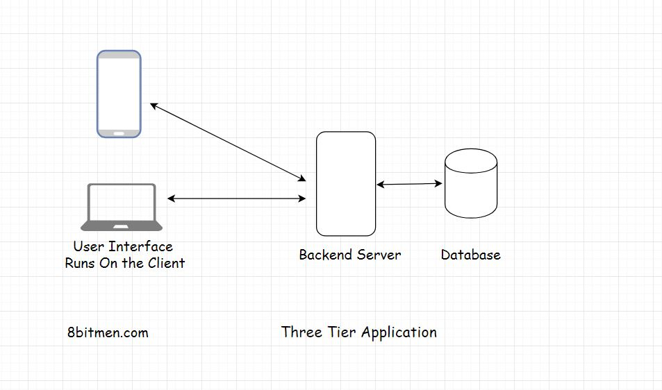

In this lesson, we will learn about the Three Tier applications.

<em>Three-tier</em> applications are pretty popular &amp; largely used in the industry. Almost all of the simple websites like blogs, news websites etc. are part of this category.

<blockquote data-id="5f204c34a77480eb9da1da4845f7276f">

In a <em>three-tier</em> application the <em>user interface</em>, application logic &amp; the <em>database</em> all lie on different machines &amp; thus have different <em>tiers</em>. They are physically separated.

</blockquote>

So, if we take the example of a simple blog, the user interface would be written using <em>Html</em>, <em>JavaScript</em>, <em>CSS</em>, the backend application logic would run on a server like <em>Apache</em> &amp; the <em>database</em> would be <em>MySQL</em>. A three-tier architecture works best for simple use cases.

Alright! Now, let’s move on to learn about the <em>N-tier</em> applications.

