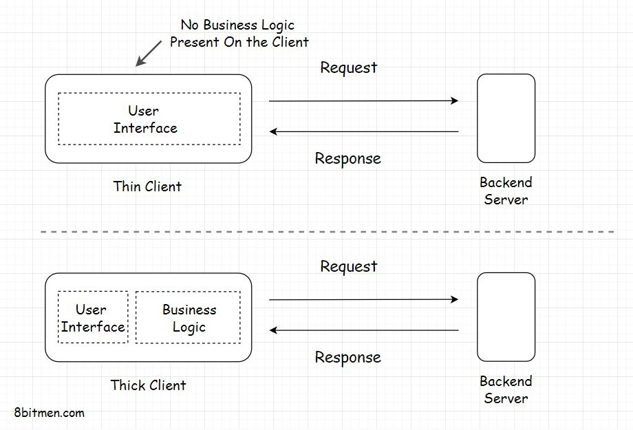

In this lesson, we will learn about the two types of client: the Thin Client and the Thick Client (sometimes also called the Fat Client).

We'll cover the following
<svg xmlns="http://www.w3.org/2000/svg" width="24" height="24" viewBox="0 0 24 24" fill="none" stroke="currentColor" stroke-width="2" stroke-linecap="round" stroke-linejoin="round"><polyline points="18 15 12 9 6 15"></polyline></svg>

<ul>
<li>
<ul>
<li><a href="#thin-client">Thin Client</a></li>
</ul>
</li>
<li>
<ul>
<li><a href="#thick-client">Thick Client</a></li>
</ul>
</li>
</ul>

There are primarily two types of clients:

<ol data-id="5f0d40c69193078e65bca512d3747273">
<li><em>Thin Client</em></li>
<li><em>Thick Client</em> (sometimes also called the <em>Fat client</em>)</li>
</ol>

<h2 id="thin-client" data-id="9e36445521972a96ad0811a8e73b7c8a">Thin Client <a class="markdownIt-Anchor" href="#thin-client">#</a></h2>

<em>Thin Client</em> is the client which holds just the user interface of the application. It has no business logic of any sort. For every action, the client sends a request to the backend server. Just like in a <em>three-tier</em> application.

<h2 id="thick-client" data-id="ea3cae01a1175234bd7abd4d5407e137">Thick Client <a class="markdownIt-Anchor" href="#thick-client">#</a></h2>

On the contrary, the thick client holds all or some part of the business logic. These are the two-tier applications. We’ve already gone through this if you remember.

The typical examples of Fat clients are utility apps, online games etc.

