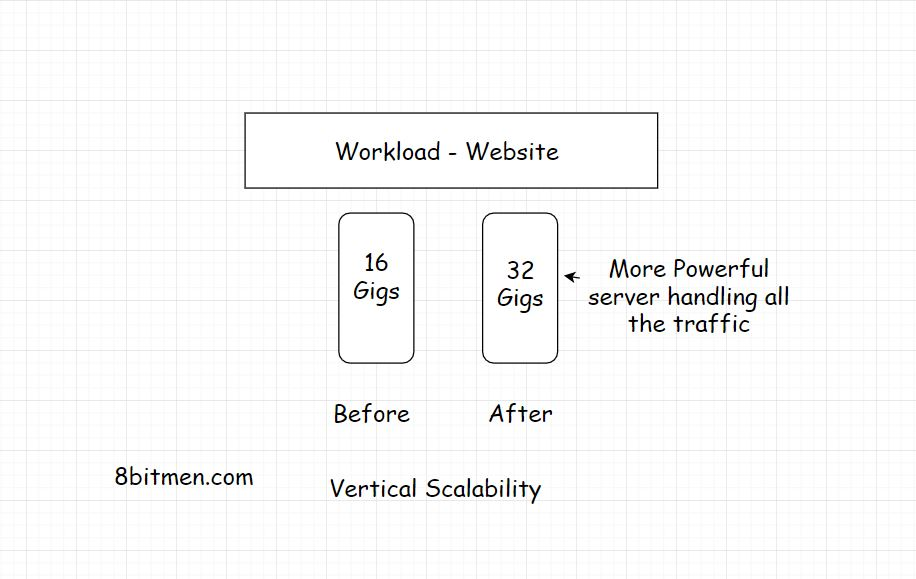
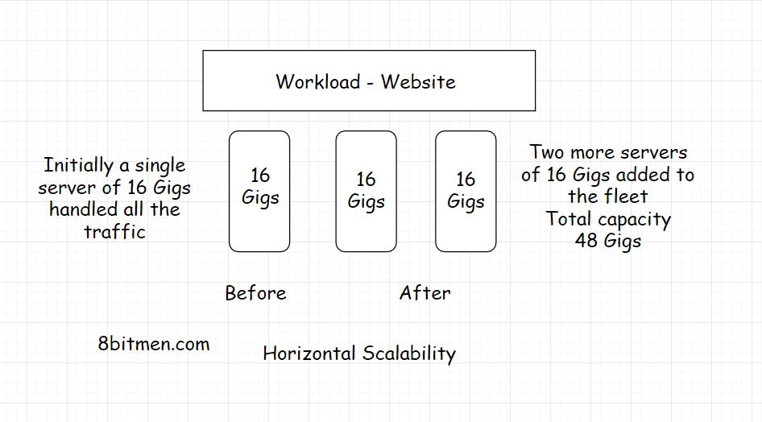

In this lesson, we will explore the two types of scaling: Vertical and Horizontal Scaling.

We'll cover the following
<svg xmlns="http://www.w3.org/2000/svg" width="24" height="24" viewBox="0 0 24 24" fill="none" stroke="currentColor" stroke-width="2" stroke-linecap="round" stroke-linejoin="round"><polyline points="18 15 12 9 6 15"></polyline></svg>

<ul>
<li>
<ul>
<li><a href="#what-is-vertical-scaling">What is Vertical Scaling?</a></li>
</ul>
</li>
<li>
<ul>
<li><a href="#what-is-horizontal-scaling">What is Horizontal Scaling?</a></li>
</ul>
</li>
<li>
<ul>
<li><a href="#cloud-elasticity">Cloud Elasticity</a></li>
</ul>
</li>
</ul>

An application to scale well needs solid computing power. The servers should be powerful enough to handle increased traffic loads.

There are two ways to scale an application:

<ol data-id="d6a7c3d5a35053c63f0c21b8fe5dad14">
<li>Vertical Scaling</li>
<li>Horizontal Scaling</li>
</ol>

<h2 id="what-is-vertical-scaling" data-id="6f6f588705a6676abd238f9c320732b8">What is Vertical Scaling? <a class="markdownIt-Anchor" href="#what-is-vertical-scaling">#</a></h2>

Vertical scaling means adding more power to your server. Let’s say your app is hosted by a server with 16 Gigs of RAM. To handle the increased load you increase the RAM to 32 Gigs. You have vertically scaled the server.

Ideally, when the traffic starts to build upon your app the first step should be to scale vertically. Vertical scaling is also called <em>scaling up</em>.

In this type of scaling we increase the power of the hardware running the app. This is the simplest way to scale since it doesn’t require any code refactoring, not making any complex configurations and stuff. I’ll discuss further down the lesson, why code refactoring is required when we horizontally scale the app.

But there is only so much we can do when scaling vertically. There is a limit to the capacity we can augment for a single server.

A good analogy would be to think of a multi-story building we can keep adding floors to it but only upto a certain point. What if the number of people in need of a flat keeps rising? We can’t scale up the building to the moon, for obvious reasons.

Now is the time to build more buildings. This is where <em>Horizontal Scalability</em> comes in.

When the traffic is just too much to be handled by single hardware, we bring in more servers to work together.

<h2 id="what-is-horizontal-scaling" data-id="9ae725f3b250ab33b6c3a9932afbd685">What is Horizontal Scaling? <a class="markdownIt-Anchor" href="#what-is-horizontal-scaling">#</a></h2>

Horizontal scaling, also known as <em>scaling out</em>, means adding more hardware to the existing hardware resource pool. This increases the computational power of the system as a whole.

Now the increased traffic influx can be easily dealt with the increased computational capacity &amp; there is literally no limit to how much we can scale horizontally assuming we have infinite resources. We can keep adding servers after servers, setting up data centres after data centres.

Horizontal scaling also provides us with the ability to dynamically scale in real-time as the traffic on our website increases &amp; decreases over a period of time as opposed to vertical scaling which requires pre-planning &amp; a stipulated time to be pulled off.

<h2 id="cloud-elasticity" data-id="6a9224bfeaf1ae58f88a7c9a8ff9e533">Cloud Elasticity <a class="markdownIt-Anchor" href="#cloud-elasticity">#</a></h2>

The biggest reason why <em>cloud computing</em> got so popular in the industry is the ability to scale up &amp; down dynamically. The ability to use &amp; pay only for the resources required by the website became a trend for obvious reasons.

If the site has a heavy traffic influx more server nodes get added &amp; when it doesn’t the dynamically added nodes are removed.

This approach saves businesses bags of money every single day. The approach is also known as <em>cloud elasticity</em>. It indicates the stretching &amp; returning to the original infrastructural computational capacity.

Having multiple server nodes on the backend also helps with the website staying alive online all the time even if a few server nodes crash. This is known as <em>High Availability</em>. We’ll get to that in the upcoming lessons.

