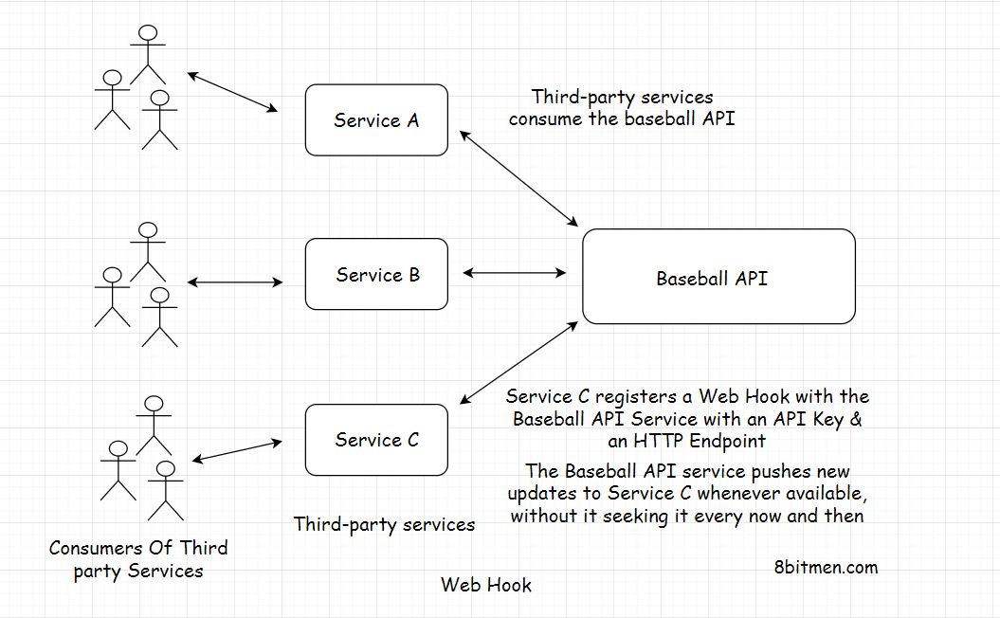

In this lesson, we’ll understand the need for web hooks &amp; how do they work?

We'll cover the following
<svg xmlns="http://www.w3.org/2000/svg" width="24" height="24" viewBox="0 0 24 24" fill="none" stroke="currentColor" stroke-width="2" stroke-linecap="round" stroke-linejoin="round"><polyline points="18 15 12 9 6 15"></polyline></svg>

<ul>
<li>
<ul>
<li><a href="#what-are-web-hooks">What Are Web Hooks?</a></li>
</ul>
</li>
<li>
<ul>
<li><a href="#how-do-web-hooks-work">How Do Web Hooks Work?</a></li>
</ul>
</li>
</ul>

<h2 id="what-are-web-hooks" data-id="5d1b9e437fdbe950af541280a155f4ab">What Are Web Hooks? <a class="markdownIt-Anchor" href="#what-are-web-hooks">#</a></h2>

Imagine you’ve written an <em>API</em> which provides information on the latest exclusive events on <em>Baseball</em>. Now your <em>API</em> is consumed by a lot many third-party services, that fetch the information from the API, add their own flavour to it &amp; present it before their users.

But so many API requests every now and then, just to check if a particular event has occurred is crushing your server. The server can hardly keep up with the requests. There is no way for consumers to know that the new information isn’t available on the server yet, or an event hasn’t occurred yet. They just keep polling the API. This would eventually pile up the unwanted load on the server and could bring it down.

<em>What do we do? Is there a way we can cut down the load on our servers?</em>

Yes!! <em>WebHooks</em>.

<em>WebHooks</em> are more like <em>call-backs</em>. It’s like I will call you when new information is available. You carry on with your work.

<em>WebHooks</em> enable communication between two services without a middleware. They have an <em>event-based</em> mechanism.

<em>So, how do they work?</em>

<h2 id="how-do-web-hooks-work" data-id="578dc4efbc0d002a0a8fd2e347e9fb15">How Do Web Hooks Work? <a class="markdownIt-Anchor" href="#how-do-web-hooks-work">#</a></h2>

To use the <em>Webhooks</em>, consumers register an <em>HTTP</em> endpoint with the service with a unique <em>API</em> Key. It’s like a phone number. Call me on this number, when an event occurs. I won’t call you anymore.

Whenever the new information is available on the backend. The server fires an <em>HTTP</em> event to all the registered endpoints of the consumers, notifying them of the new update.

Browser notifications are a good example of <em>Webhooks</em>. Instead of visiting the websites every now and then for new info, the websites notify us when they publish new content.

