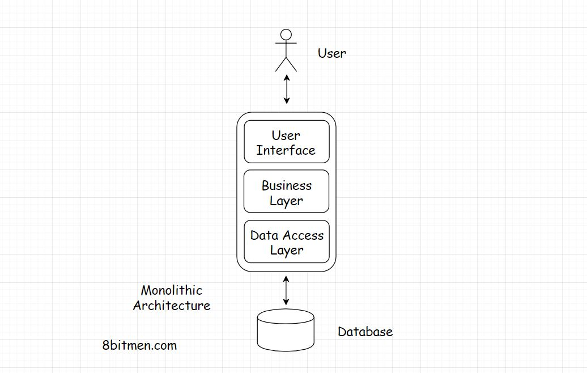

In this lesson, we will discuss the Monolithic Architecture.

We'll cover the following
<svg xmlns="http://www.w3.org/2000/svg" width="24" height="24" viewBox="0 0 24 24" fill="none" stroke="currentColor" stroke-width="2" stroke-linecap="round" stroke-linejoin="round"><polyline points="18 15 12 9 6 15"></polyline></svg>

<ul>
<li>
<ul>
<li><a href="#what-is-a-monolithic-architecture">What Is A Monolithic Architecture?</a></li>
</ul>
</li>
</ul>

<h2 id="what-is-a-monolithic-architecture" data-id="33388a834ce807e1ced415788d68ea09">What Is A Monolithic Architecture? <a class="markdownIt-Anchor" href="#what-is-a-monolithic-architecture">#</a></h2>
<blockquote data-id="36c4d7ad4458143dc535a6618e9c2fec">

An application has a monolithic architecture if it contains the entire application code in a single codebase.

</blockquote>

A monolithic application is a self-contained, single-tiered software application unlike the microservices architecture, where different modules are responsible for running respective tasks and features of an app.

The diagram below represents a monolithic architecture:

In a monolithic web-app all the different layers of the app, UI, business, data access etc. are in the same codebase.

We have the <em>Controller</em>, then the <em>Service Layer interface</em>, <em>Class</em> implementations of the interface, the <em>business logic</em> goes in the <em>Object Domain model</em>, a bit in the Service, Business and the <em>Repository/DAO [Data Access Object]</em> classes.

Monolithic apps are simple to build, test &amp; deploy in comparison to a microservices architecture.

There are times during the initial stages of the business when teams chose to move forward with the monolithic architecture &amp; then later intend to branch out into the distributed, microservices architecture.

Well, this decision has several trade-offs. And there is no standard solution to this.

In the present computing landscape, the applications are being built &amp; deployed on the cloud. A wise decision would be to pick the loosely coupled stateless microservices architecture right from the start if you expect things to grow at quite a pace in the future.

Because re-writing stuff has its costs. Stripping down things in a tightly coupled architecture &amp; re-writing stuff demands a lot of resources &amp; time.

On the flip side, if your requirements are simple why bother writing a microservices architecture? Running different modules in conjunction with each other isn’t a walk in the park.

Let’s go through some of the pros and cons of monolithic architecture.

